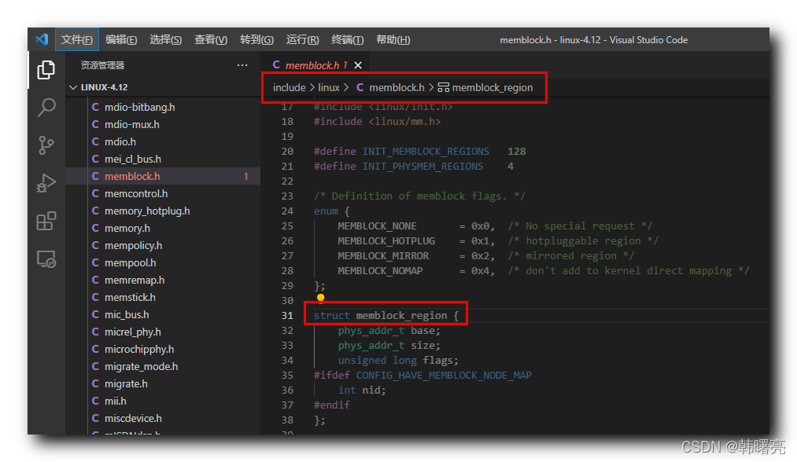

【Linux 内核 内存管理】memblock 分配器 ③ ( memblock_region 内存块区域 | memblock_region 结构体成员分析 | memblock 分配器标志位 )

#### 文章目录

-   [一、memblock\_region 内存块区域](https://cloud.tencent.com/developer?from_column=20421&from=20421)
-   [二、memblock\_region 结构体成员分析](https://cloud.tencent.com/developer?from_column=20421&from=20421)
-   -   [1、base 成员](https://cloud.tencent.com/developer?from_column=20421&from=20421)
    -   [2、size 成员](https://cloud.tencent.com/developer?from_column=20421&from=20421)
    -   [3、flags 成员](https://cloud.tencent.com/developer?from_column=20421&from=20421)
    -   [4、nid 成员](https://cloud.tencent.com/developer?from_column=20421&from=20421)
-   [三、memblock 分配器标志枚举](https://cloud.tencent.com/developer?from_column=20421&from=20421)
-   -   [1、MEMBLOCK\_NONE](https://cloud.tencent.com/developer?from_column=20421&from=20421)
    -   [2、MEMBLOCK\_HOTPLUG](https://cloud.tencent.com/developer?from_column=20421&from=20421)
    -   [3、MEMBLOCK\_MIRROR](https://cloud.tencent.com/developer?from_column=20421&from=20421)
    -   [4、MEMBLOCK\_NOMAP](https://cloud.tencent.com/developer?from_column=20421&from=20421)

## 一、memblock\_region 内存块区域

* * *

memblock 分配器 中 , 内存块区域 使用 `struct memblock_region` 结构体进行描述 ,

该结构体定义在 Linux 内核源码的 linux-4.12\\include\\linux\\memblock.h#31 位置

代码语言：javascript

复制

    /* Definition of memblock flags. */
    enum {
    	MEMBLOCK_NONE		= 0x0,	/* No special request */
    	MEMBLOCK_HOTPLUG	= 0x1,	/* hotpluggable region */
    	MEMBLOCK_MIRROR		= 0x2,	/* mirrored region */
    	MEMBLOCK_NOMAP		= 0x4,	/* don't add to kernel direct mapping */
    };
    
    struct memblock_region {
    	phys_addr_t base;
    	phys_addr_t size;
    	unsigned long flags;
    #ifdef CONFIG_HAVE_MEMBLOCK_NODE_MAP
    	int nid;
    #endif
    };

**源码路径 :** linux-4.12\\include\\linux\\memblock.h#31

在这里插入图片描述

## 二、memblock\_region 结构体成员分析

* * *

### 1、base 成员

`base` 成员 表示 " 内存块区域 " 的起始地址 ;

代码语言：javascript

复制

    	phys_addr_t base;

### 2、size 成员

`size` 成员 表示 " 内存块区域 " 的大小 ;

代码语言：javascript

复制

    	phys_addr_t size;

### 3、flags 成员

`flags` 成员 表示 " 内存块区域 " 的标志位 ;

代码语言：javascript

复制

    	unsigned long flags;

**可设置的标志位如下 :**

代码语言：javascript

复制

    /* Definition of memblock flags. */
    enum {
    	MEMBLOCK_NONE		= 0x0,	/* No special request */
    	MEMBLOCK_HOTPLUG	= 0x1,	/* hotpluggable region */
    	MEMBLOCK_MIRROR		= 0x2,	/* mirrored region */
    	MEMBLOCK_NOMAP		= 0x4,	/* don't add to kernel direct mapping */
    };

### 4、nid 成员

`nid` 成员 表示 " 内存块区域 " 的节点编号 ;

代码语言：javascript

复制

    #ifdef CONFIG_HAVE_MEMBLOCK_NODE_MAP
    	int nid;
    #endif

## 三、memblock 分配器标志枚举

* * *

memblock 分配器标志是一个枚举类型 ,

该 枚举 定义在 Linux 内核源码的 linux-4.12\\include\\linux\\memblock.h#23 位置 ;

代码语言：javascript

复制

    /* Definition of memblock flags. */
    enum {
    	MEMBLOCK_NONE		= 0x0,	/* No special request */
    	MEMBLOCK_HOTPLUG	= 0x1,	/* hotpluggable region */
    	MEMBLOCK_MIRROR		= 0x2,	/* mirrored region */
    	MEMBLOCK_NOMAP		= 0x4,	/* don't add to kernel direct mapping */
    };

### 1、MEMBLOCK\_NONE

`MEMBLOCK_NONE` 表示 " 没有特殊要求的区域 " ;

代码语言：javascript

复制

    	MEMBLOCK_NONE		= 0x0,	/* No special request */

### 2、MEMBLOCK\_HOTPLUG

`MEMBLOCK_HOTPLUG` 表示 " 支持热插拔区域 " , 在运行过程中 , 物理内存可以 " 热插拔 " ;

代码语言：javascript

复制

    	MEMBLOCK_HOTPLUG	= 0x1,	/* hotpluggable region */

### 3、MEMBLOCK\_MIRROR

`MEMBLOCK_MIRROR` 表示 " 镜像区域 " ;

Linux 内核将 内存中的数据 , 进行了复制备份 , 分别存放在 " 主内存 " 和 " 镜像内存 " 中 ;

代码语言：javascript

复制

    	MEMBLOCK_MIRROR		= 0x2,	/* mirrored region */

### 4、MEMBLOCK\_NOMAP

`MEMBLOCK_NONE` 表示 " 线性映射区域 " , 该区域不添加到内核映射区域 ;

代码语言：javascript

复制

    	MEMBLOCK_NOMAP		= 0x4,	/* don't add to kernel direct mapping */

## 参考

[【Linux 内核 内存管理】memblock 分配器 ③ ( memblock_region 内存块区域 | memblock_region 结构体成员分析 | memblock 分配器标志位 )-腾讯云开发者社区-腾讯云 (tencent.com)](https://cloud.tencent.com/developer/article/2253524)