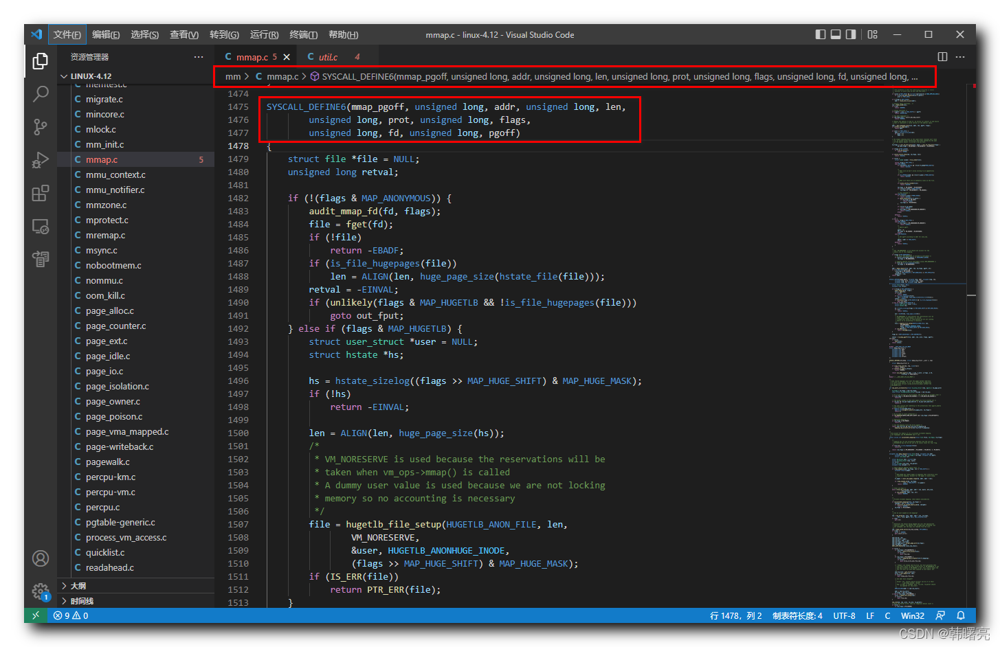

【Linux 内核 内存管理】mmap 系统调用源码分析 ② ( sys\_mmap\_pgoff 系统调用函数执行流程 | sys\_mmap\_pgoff 函数源码 )

#### 文章目录

-   [一、sys\_mmap\_pgoff 系统调用函数执行流程](https://cloud.tencent.com/developer?from_column=20421&from=20421)
-   [二、sys\_mmap\_pgoff 系统调用函数源码](https://cloud.tencent.com/developer?from_column=20421&from=20421)

调用 `mmap` 系统调用 , 先检查 " 偏移 " 是否是 " 内存页大小 " 的 " 整数倍 " , 如果偏移是内存页大小的整数倍 , 则调用 `sys_mmap_pgoff` 函数 , 继续向下执行 ;

## 一、sys\_mmap\_pgoff 系统调用函数执行流程

* * *

在 `sys_mmap_pgoff` 函数中 ,

首先 , 进行 " 文件映射 " , 进程 中 维护了一个 打开文件 列表 , 根据 " 文件描述符 " 在上述列表 中查找 文件实例 ;

然后 , 执行 " 匿名巨型页映射 " , 在 `hugetlbfs` 文件系统中 , 创建文件 " 巨型页 " , 即 `anon_hugepage` ;

最后 , 调用了 `vm_mmap_pgoff` 函数 , 继续向后执行 ;

## 二、sys\_mmap\_pgoff 系统调用函数源码

* * *

该 `sys_mmap_pgoff` 系统调用函数源码 , 定义在 Linux 内核源码的 linux-4.12\\mm\\mmap.c#1475 位置 ;

**`sys_mmap_pgoff` 函数源码如下 :**

代码语言：javascript

复制

    SYSCALL_DEFINE6(mmap_pgoff, unsigned long, addr, unsigned long, len,
    		unsigned long, prot, unsigned long, flags,
    		unsigned long, fd, unsigned long, pgoff)
    {
    	struct file *file = NULL;
    	unsigned long retval;
    
    	if (!(flags & MAP_ANONYMOUS)) {
    		audit_mmap_fd(fd, flags);
    		file = fget(fd);
    		if (!file)
    			return -EBADF;
    		if (is_file_hugepages(file))
    			len = ALIGN(len, huge_page_size(hstate_file(file)));
    		retval = -EINVAL;
    		if (unlikely(flags & MAP_HUGETLB && !is_file_hugepages(file)))
    			goto out_fput;
    	} else if (flags & MAP_HUGETLB) {
    		struct user_struct *user = NULL;
    		struct hstate *hs;
    
    		hs = hstate_sizelog((flags >> MAP_HUGE_SHIFT) & MAP_HUGE_MASK);
    		if (!hs)
    			return -EINVAL;
    
    		len = ALIGN(len, huge_page_size(hs));
    		/*
    		 * VM_NORESERVE is used because the reservations will be
    		 * taken when vm_ops->mmap() is called
    		 * A dummy user value is used because we are not locking
    		 * memory so no accounting is necessary
    		 */
    		file = hugetlb_file_setup(HUGETLB_ANON_FILE, len,
    				VM_NORESERVE,
    				&user, HUGETLB_ANONHUGE_INODE,
    				(flags >> MAP_HUGE_SHIFT) & MAP_HUGE_MASK);
    		if (IS_ERR(file))
    			return PTR_ERR(file);
    	}
    
    	flags &= ~(MAP_EXECUTABLE | MAP_DENYWRITE);
    
    	retval = vm_mmap_pgoff(file, addr, len, prot, flags, pgoff);
    out_fput:
    	if (file)
    		fput(file);
    	return retval;
    }

**源码路径 :** linux-4.12\\mm\\mmap.c#1475

## 参考

[【Linux 内核 内存管理】mmap 系统调用源码分析 ② ( sys_mmap_pgoff 系统调用函数执行流程 | sys_mmap_pgoff 函数源码 )-腾讯云开发者社区-腾讯云 (tencent.com)](https://cloud.tencent.com/developer/article/2253487)