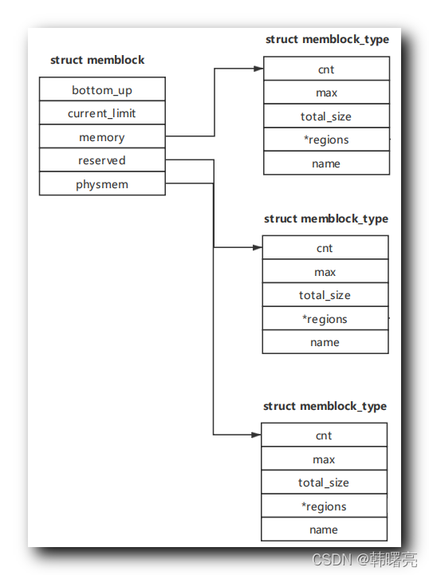
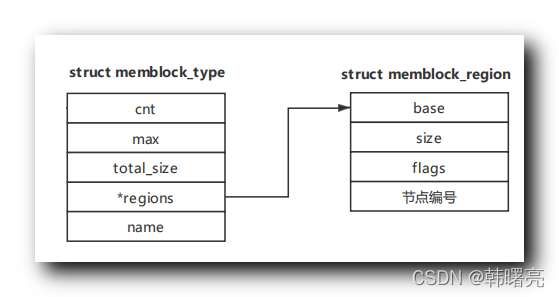
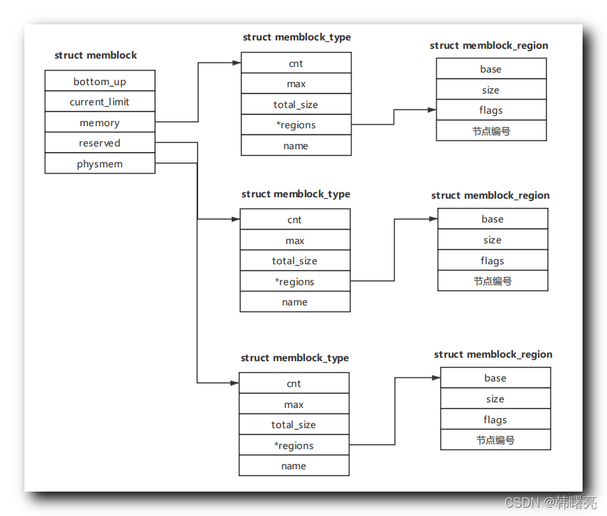

【Linux 内核 内存管理】memblock 分配器 ④ ( memblock、memblock_type、memblock_region 结构体的关系 )

#### 文章目录

-   [一、memblock、memblock\_type、memblock\_region 结构体的关系](https://cloud.tencent.com/developer?from_column=20421&from=20421)
-   -   [1、memblock、memblock\_type 关系](https://cloud.tencent.com/developer?from_column=20421&from=20421)
    -   [2、memblock\_type、memblock\_region 关系](https://cloud.tencent.com/developer?from_column=20421&from=20421)
-   [二、上述数据结构关系图示](https://cloud.tencent.com/developer?from_column=20421&from=20421)

## 一、memblock、memblock\_type、memblock\_region 结构体的关系

* * *

### 1、memblock、memblock\_type 关系

memblock 分配器 定义在 Linux 内核源码的 linux-4.12\\include\\linux\\memblock.h#48 位置 ;

代码语言：javascript

复制

    struct memblock {
    	bool bottom_up;  /* is bottom up direction? */
    	phys_addr_t current_limit;
    	struct memblock_type memory;
    	struct memblock_type reserved;
    #ifdef CONFIG_HAVE_MEMBLOCK_PHYS_MAP
    	struct memblock_type physmem;
    #endif
    };

**源码路径 :** linux-4.12\\include\\linux\\memblock.h#48

`memblock` 结构体中的 `memory` ( 内存类型 ) , `reserved` ( 预留类型 ) , `physmem` ( 物理页内存类型 ) 这

33

个成员都是 `memblock_type` 结构体实例 ;

在这里插入图片描述

### 2、memblock\_type、memblock\_region 关系

`struct memblock_type` 结构体 定义在 Linux 内核源码的 linux-4.12\\include\\linux\\memblock.h#40 位置 ;

代码语言：javascript

复制

    struct memblock_type {
    	unsigned long cnt;	/* number of regions */
    	unsigned long max;	/* size of the allocated array */
    	phys_addr_t total_size;	/* size of all regions */
    	struct memblock_region *regions;
    	char *name;
    };

**源码路径 :** linux-4.12\\include\\linux\\memblock.h#40

其中的 `regions` 成员是 `struct memblock_region` 结构体类型的指针 ;

在这里插入图片描述

## 二、上述数据结构关系图示

* * *

## 参考

[【Linux 内核 内存管理】memblock 分配器 ④ ( memblock、memblock_type、memblock_region 结构体的关系 )-腾讯云开发者社区-腾讯云 (tencent.com)](https://cloud.tencent.com/developer/article/2253526)