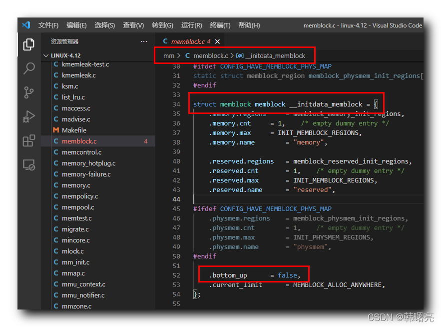

【Linux 内核 内存管理】memblock 分配器 ⑤ ( Linux 内核中定义 memblock 分配器的位置 | ARM64体系架构下 Linux内核初始化 memblock 分配器流程 )

#### 文章目录

-   [一、Linux 内核中定义 memblock 分配器的位置](https://cloud.tencent.com/developer?from_column=20421&from=20421)
-   [二、ARM64 体系架构下 Linux 内核初始化 memblock 分配器流程](https://cloud.tencent.com/developer?from_column=20421&from=20421)
-   [三、arm64\_memblock\_init 函数完整源码](https://cloud.tencent.com/developer?from_column=20421&from=20421)

## 一、Linux 内核中定义 memblock 分配器的位置

* * *

**Linux** **内核 定义 memblock 分配器 位置 :**

Linux 内核源码 linux-4.12\\mm\\memblock.c#34 位置 , 定义了 `struct memblock` 类型的变量 , 在该结构体赋值时 , `.bottom_up = false` 将 `bottom_up` 设置为了 false , 表示内存从 高地址向下分配 ;

代码语言：javascript

复制

    struct memblock memblock __initdata_memblock = {
    	.memory.regions		= memblock_memory_init_regions,
    	.memory.cnt		= 1,	/* empty dummy entry */
    	.memory.max		= INIT_MEMBLOCK_REGIONS,
    	.memory.name		= "memory",
    
    	.reserved.regions	= memblock_reserved_init_regions,
    	.reserved.cnt		= 1,	/* empty dummy entry */
    	.reserved.max		= INIT_MEMBLOCK_REGIONS,
    	.reserved.name		= "reserved",
    
    #ifdef CONFIG_HAVE_MEMBLOCK_PHYS_MAP
    	.physmem.regions	= memblock_physmem_init_regions,
    	.physmem.cnt		= 1,	/* empty dummy entry */
    	.physmem.max		= INIT_PHYSMEM_REGIONS,
    	.physmem.name		= "physmem",
    #endif
    
    	.bottom_up		= false,
    	.current_limit		= MEMBLOCK_ALLOC_ANYWHERE,
    };

**源码路径 :** linux-4.12\\mm\\memblock.c#34

在这里插入图片描述

## 二、ARM64 体系架构下 Linux 内核初始化 memblock 分配器流程

* * *

先在 linux-4.12\\init#488 位置的 `asmlinkage __visible void __init start_kernel(void)` 内核启动函数中 , 调用 `setup_arch(&command_line);` 函数 ,

在这里插入图片描述

然后再调用 ARM64 体系架构对应的源码 , linux-4.12\\arch\\arm64\\mm\\init.c#362 位置的 `void __init arm64_memblock_init(void)` 函数 , 该函数是 初始化 memblock 分配器的核心函数 ;

在这里插入图片描述

**ARM64 体系架构下 Linux 内核初始化 memblock 分配器流程 :**

① 解析 " 设备树二进制文件 " `/memory` 节点 , 将 " 所有物理内存 " 纳入到 memblock 分配器 管理之下 ;

该步骤对应的 Linux 源代码是在 linux-4.12\\arch\\arm64\\mm\\init.c#367 位置 ;

代码语言：javascript

复制

    	/* Handle linux,usable-memory-range property */
    	fdt_enforce_memory_region();

**源码路径 :** linux-4.12\\arch\\arm64\\mm\\init.c#367

在这里插入图片描述

② 设置 全局变量 `memstart_addr` , 用于记录 物理内存 的 起始地址 ;

代码语言：javascript

复制

    	/*
    	 * Select a suitable value for the base of physical memory.
    	 */
    	memstart_addr = round_down(memblock_start_of_DRAM(),
    				   ARM64_MEMSTART_ALIGN);

**源码路径 :** linux-4.12\\arch\\arm64\\mm\\init.c#379

在这里插入图片描述

③ 从 memblock 分配器 中 , 删除 " 线性映射区域 不能覆盖的 指定范围的 物理内存 " ;

代码语言：javascript

复制

    	/*
    	 * Remove the memory that we will not be able to cover with the
    	 * linear mapping. Take care not to clip the kernel which may be
    	 * high in memory.
    	 */
    	memblock_remove(max_t(u64, memstart_addr + linear_region_size,
    			__pa_symbol(_end)), ULLONG_MAX);

**源码路径 :** linux-4.12\\arch\\arm64\\mm\\init.c#387

在这里插入图片描述

④ 使用 mem 可以指定 " 设备树二进制文件中指定命令行 " 的 " 可用内存 " 大小 ,

如果指定了该可用内存大小 , 需要从 memblock 分配器 中 , 删除该大小之外超出的部分物理内存 ;

代码语言：javascript

复制

    	/*
    	 * Apply the memory limit if it was set. Since the kernel may be loaded
    	 * high up in memory, add back the kernel region that must be accessible
    	 * via the linear mapping.
    	 */
    	if (memory_limit != (phys_addr_t)ULLONG_MAX) {
    		memblock_mem_limit_remove_map(memory_limit);
    		memblock_add(__pa_symbol(_text), (u64)(_end - _text));
    	}

**源码路径 :** linux-4.12\\arch\\arm64\\mm\\init.c#401

在这里插入图片描述

⑤ 将 内核镜像 占用的 物理内存 纳入到 memblock 分配器 管理之下 ;

代码语言：javascript

复制

    	/*
    	 * Register the kernel text, kernel data, initrd, and initial
    	 * pagetables with memblock.
    	 */
    	memblock_reserve(__pa_symbol(_text), _end - _text);

**源码路径 :** linux-4.12\\arch\\arm64\\mm\\init.c#456

在这里插入图片描述

⑥ 初始化 " 设备树二进制文件 " 内存区域 对应的 设备源文件相关字段和节点 ;

代码语言：javascript

复制

    	early_init_fdt_scan_reserved_mem();

**源码路径 :** linux-4.12\\arch\\arm64\\mm\\init.c#467

在这里插入图片描述

## 三、arm64\_memblock\_init 函数完整源码

* * *

代码语言：javascript

复制

    void __init arm64_memblock_init(void)
    {
    	const s64 linear_region_size = -(s64)PAGE_OFFSET;
    
    	/* Handle linux,usable-memory-range property */
    	fdt_enforce_memory_region();
    
    	/*
    	 * Ensure that the linear region takes up exactly half of the kernel
    	 * virtual address space. This way, we can distinguish a linear address
    	 * from a kernel/module/vmalloc address by testing a single bit.
    	 */
    	BUILD_BUG_ON(linear_region_size != BIT(VA_BITS - 1));
    
    	/*
    	 * Select a suitable value for the base of physical memory.
    	 */
    	memstart_addr = round_down(memblock_start_of_DRAM(),
    				   ARM64_MEMSTART_ALIGN);
    
    	/*
    	 * Remove the memory that we will not be able to cover with the
    	 * linear mapping. Take care not to clip the kernel which may be
    	 * high in memory.
    	 */
    	memblock_remove(max_t(u64, memstart_addr + linear_region_size,
    			__pa_symbol(_end)), ULLONG_MAX);
    	if (memstart_addr + linear_region_size < memblock_end_of_DRAM()) {
    		/* ensure that memstart_addr remains sufficiently aligned */
    		memstart_addr = round_up(memblock_end_of_DRAM() - linear_region_size,
    					 ARM64_MEMSTART_ALIGN);
    		memblock_remove(0, memstart_addr);
    	}
    
    	/*
    	 * Apply the memory limit if it was set. Since the kernel may be loaded
    	 * high up in memory, add back the kernel region that must be accessible
    	 * via the linear mapping.
    	 */
    	if (memory_limit != (phys_addr_t)ULLONG_MAX) {
    		memblock_mem_limit_remove_map(memory_limit);
    		memblock_add(__pa_symbol(_text), (u64)(_end - _text));
    	}
    
    	if (IS_ENABLED(CONFIG_BLK_DEV_INITRD) && initrd_start) {
    		/*
    		 * Add back the memory we just removed if it results in the
    		 * initrd to become inaccessible via the linear mapping.
    		 * Otherwise, this is a no-op
    		 */
    		u64 base = initrd_start & PAGE_MASK;
    		u64 size = PAGE_ALIGN(initrd_end) - base;
    
    		/*
    		 * We can only add back the initrd memory if we don't end up
    		 * with more memory than we can address via the linear mapping.
    		 * It is up to the bootloader to position the kernel and the
    		 * initrd reasonably close to each other (i.e., within 32 GB of
    		 * each other) so that all granule/#levels combinations can
    		 * always access both.
    		 */
    		if (WARN(base < memblock_start_of_DRAM() ||
    			 base + size > memblock_start_of_DRAM() +
    				       linear_region_size,
    			"initrd not fully accessible via the linear mapping -- please check your bootloader ...\n")) {
    			initrd_start = 0;
    		} else {
    			memblock_remove(base, size); /* clear MEMBLOCK_ flags */
    			memblock_add(base, size);
    			memblock_reserve(base, size);
    		}
    	}
    
    	if (IS_ENABLED(CONFIG_RANDOMIZE_BASE)) {
    		extern u16 memstart_offset_seed;
    		u64 range = linear_region_size -
    			    (memblock_end_of_DRAM() - memblock_start_of_DRAM());
    
    		/*
    		 * If the size of the linear region exceeds, by a sufficient
    		 * margin, the size of the region that the available physical
    		 * memory spans, randomize the linear region as well.
    		 */
    		if (memstart_offset_seed > 0 && range >= ARM64_MEMSTART_ALIGN) {
    			range = range / ARM64_MEMSTART_ALIGN + 1;
    			memstart_addr -= ARM64_MEMSTART_ALIGN *
    					 ((range * memstart_offset_seed) >> 16);
    		}
    	}
    
    	/*
    	 * Register the kernel text, kernel data, initrd, and initial
    	 * pagetables with memblock.
    	 */
    	memblock_reserve(__pa_symbol(_text), _end - _text);
    #ifdef CONFIG_BLK_DEV_INITRD
    	if (initrd_start) {
    		memblock_reserve(initrd_start, initrd_end - initrd_start);
    
    		/* the generic initrd code expects virtual addresses */
    		initrd_start = __phys_to_virt(initrd_start);
    		initrd_end = __phys_to_virt(initrd_end);
    	}
    #endif
    
    	early_init_fdt_scan_reserved_mem();
    
    	/* 4GB maximum for 32-bit only capable devices */
    	if (IS_ENABLED(CONFIG_ZONE_DMA))
    		arm64_dma_phys_limit = max_zone_dma_phys();
    	else
    		arm64_dma_phys_limit = PHYS_MASK + 1;
    
    	reserve_crashkernel();
    
    	reserve_elfcorehdr();
    
    	dma_contiguous_reserve(arm64_dma_phys_limit);
    
    	memblock_allow_resize();
    }

## 参考

[【Linux 内核 内存管理】memblock 分配器 ⑤ ( Linux 内核中定义 memblock 分配器的位置 | ARM64体系架构下 Linux内核初始化 memblock 分配器流程 )-腾讯云开发者社区-腾讯云 (tencent.com)](https://cloud.tencent.com/developer/article/2253528)