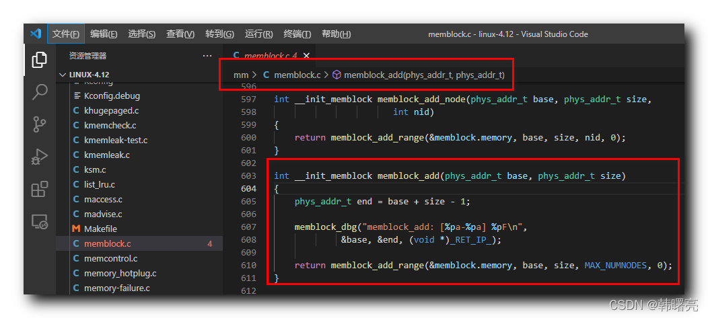

【Linux 内核 内存管理】memblock 分配器编程接口 ① ( memblock 分配器编程接口简介 | memblock_add 函数原型分析 | memblock_add 函数源码 )

#### 文章目录

-   [一、memblock 分配器编程接口](https://cloud.tencent.com/developer?from_column=20421&from=20421)
-   [二、memblock\_add 函数原型分析](https://cloud.tencent.com/developer?from_column=20421&from=20421)
-   [三、memblock\_add 函数源码](https://cloud.tencent.com/developer?from_column=20421&from=20421)

## 一、memblock 分配器编程接口

* * *

**memblock 分配器提供了如下编程接口 :**

**① 添加内存 :** `memblock_add` 函数 , 将 内存块区域 添加到 `memblock.memory` 成员中 , 即 插入一块可用的物理内存 ;

**② 删除内存 :** `memblock_remove` 函数 , 删除 内存块区域 ;

**③ 分配内存 :** `memblock_alloc` 函数 , 申请分配内存 ;

**④ 释放内存 :** `memblock_free` 函数 , 释放之前分配的内存 ;

## 二、memblock\_add 函数原型分析

* * *

`memblock_add` 函数 , 将 内存块区域 添加到 `memblock.memory` 成员中 , 即 插入一块可用的物理内存 ;

**`memblock_add` 函数原型如下 :**

代码语言：javascript

复制

    int __init_memblock memblock_add(phys_addr_t base, phys_addr_t size)

`phys_addr_t base` 参数 表示 被添加的 " 内存块 " 的 " 起始地址 " ;

`phys_addr_t size` 参数 表示 被添加的 " 内存块 " 的 " 大小 " ;

在 `memblock_add` 函数 中 , 调用 `memblock_add_range` 函数 , 将内存块添加到 `memblock.memory` 中 ;

代码语言：javascript

复制

    memblock_add_range(&memblock.memory, base, size, MAX_NUMNODES, 0);

## 三、memblock\_add 函数源码

* * *

`memblock_add` 函数 定义在 Linux 内核源码的 linux-4.12\\mm\\memblock.c#603 位置 ;

代码语言：javascript

复制

    int __init_memblock memblock_add(phys_addr_t base, phys_addr_t size)
    {
    	phys_addr_t end = base + size - 1;
    
    	memblock_dbg("memblock_add: [%pa-%pa] %pF\n",
    		     &base, &end, (void *)_RET_IP_);
    
    	return memblock_add_range(&memblock.memory, base, size, MAX_NUMNODES, 0);
    }

**源码路径 :** linux-4.12\\mm\\memblock.c#603

## 参考

[【Linux 内核 内存管理】memblock 分配器编程接口 ① ( memblock 分配器编程接口简介 | memblock_add 函数原型分析 | memblock_add 函数源码 )-腾讯云开发者社区-腾讯云 (tencent.com)](https://cloud.tencent.com/developer/article/2253529)