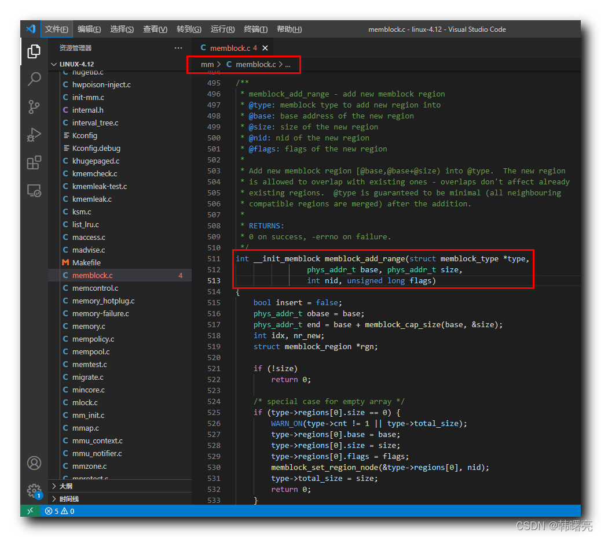

【Linux 内核 内存管理】memblock 分配器编程接口 ② ( memblock_add_range 函数分析 | memblock_insert_region 函数分析 )

#### 文章目录

- [一、memblock_add_range 函数原型分析](https://cloud.tencent.com/developer?from_column=20421&from=20421)
- [二、memblock_add_range 函数源码分析](https://cloud.tencent.com/developer?from_column=20421&from=20421)
- [三、memblock_insert_region 函数原型分析](https://cloud.tencent.com/developer?from_column=20421&from=20421)
- [四、memblock_add_range 函数源码](https://cloud.tencent.com/developer?from_column=20421&from=20421)

## 一、memblock_add_range 函数原型分析

------

在 `memblock_add` 函数 中 , 调用 `memblock_add_range` 函数 插入了一块内存 ;

**`memblock_add_range` 函数 原型如下 :**

代码语言：javascript

复制

```javascript
int __init_memblock memblock_add_range(struct memblock_type *type,
				phys_addr_t base, phys_addr_t size,
				int nid, unsigned long flags)
```

**源码路径 :** linux-4.12\mm\memblock.c#511

`struct memblock_type *type` 参数 表示 指向要添加到新区域的 内存块 类型 ;

`phys_addr_t base` 参数 表示 新加入的 内存块 的 起始地址 ;

`phys_addr_t size` 参数 表示 新加入 内存块 的 大小 ;

`int nid` 参数 表示 新区域的 nid , 指向 NUMA 结构 ;

`unsigned long flags` 参数 表示 新加入 内存块 的 标志位 ;

## 二、memblock_add_range 函数源码分析

------

**内存块对比 :** 在该函数中 , 调用了如下代码 , 其作用是 遍历 所有 " 内存块 " , 每次遍历 , 都将 " 新的内存区块 " 与 " 该内存块 " 进行对比 ;

代码语言：javascript

复制

```javascript
	for_each_memblock_type(type, rgn) {
		phys_addr_t rbase = rgn->base;
		phys_addr_t rend = rbase + rgn->size;

		if (rbase >= end)
			break;
		if (rend <= base)
			continue;
		/*
		 * @rgn overlaps.  If it separates the lower part of new
		 * area, insert that portion.
		 */
		if (rbase > base) {
#ifdef CONFIG_HAVE_MEMBLOCK_NODE_MAP
			WARN_ON(nid != memblock_get_region_node(rgn));
#endif
			WARN_ON(flags != rgn->flags);
			nr_new++;
			if (insert)
				memblock_insert_region(type, idx++, base,
						       rbase - base, nid,
						       flags);
		}
		/* area below @rend is dealt with, forget about it */
		base = min(rend, end);
	}
```

**源码路径 :** linux-4.12\mm\memblock.c#543

**插入内存 :** 假如 起始地址 , 小于 end 地址 , 则需要插入内存 , 调用 `memblock_insert_region` 函数 , 完成内存插入操作 ;

代码语言：javascript

复制

```javascript
	/* insert the remaining portion */
	if (base < end) {
		nr_new++;
		if (insert)
			memblock_insert_region(type, idx, base, end - base,
					       nid, flags);
	}
```

**源码路径 :** linux-4.12\mm\memblock.c#571/font>

**内存**[**区块链**](https://cloud.tencent.com/developer/techpedia/1573?from_column=20065&from=20065)**表标志 :** `nr_new` 参数表示 是否有新的 " 内存块 " 要加入到 " 内存区块链表 " 中 ;

代码语言：javascript

复制

```javascript
	if (!nr_new)
		return 0;
```

## 三、memblock_insert_region 函数原型分析

------

**`memblock_insert_region` 函数原型如下 :**

`struct memblock_type *type` 参数 指针指向内存区

`int idx` 参数 表示 内存区链表索引

`phys_addr_t base` 参数表示 内存区 基地址

`phys_addr_t size` 参数 表示 内存区大小

`int nid` 参数 表示 内存节点 id

`unsigned long flags` 参数 表示 内存块标志位

代码语言：javascript

复制

```javascript
/**
 * memblock_insert_region - insert new memblock region
 * @type:	memblock type to insert into
 * @idx:	index for the insertion point
 * @base:	base address of the new region
 * @size:	size of the new region
 * @nid:	node id of the new region
 * @flags:	flags of the new region
 *
 * Insert new memblock region [@base,@base+@size) into @type at @idx.
 * @type must already have extra room to accommodate the new region.
 */
static void __init_memblock memblock_insert_region(struct memblock_type *type,
						   int idx, phys_addr_t base,
						   phys_addr_t size,
						   int nid, unsigned long flags)
```

**源码路径 :** linux-4.12\mm\memblock.c#478

## 四、memblock_add_range 函数源码

------

`memblock_add_range` 函数 定义在 Linux 内核源码的 linux-4.12\mm\memblock.c#511 位置 ;



在这里插入图片描述

代码语言：javascript

复制

```javascript
/**
 * memblock_add_range - add new memblock region
 * @type: memblock type to add new region into
 * @base: base address of the new region
 * @size: size of the new region
 * @nid: nid of the new region
 * @flags: flags of the new region
 *
 * Add new memblock region [@base,@base+@size) into @type.  The new region
 * is allowed to overlap with existing ones - overlaps don't affect already
 * existing regions.  @type is guaranteed to be minimal (all neighbouring
 * compatible regions are merged) after the addition.
 *
 * RETURNS:
 * 0 on success, -errno on failure.
 */
int __init_memblock memblock_add_range(struct memblock_type *type,
				phys_addr_t base, phys_addr_t size,
				int nid, unsigned long flags)
{
	bool insert = false;
	phys_addr_t obase = base;
	phys_addr_t end = base + memblock_cap_size(base, &size);
	int idx, nr_new;
	struct memblock_region *rgn;

	if (!size)
		return 0;

	/* special case for empty array */
	if (type->regions[0].size == 0) {
		WARN_ON(type->cnt != 1 || type->total_size);
		type->regions[0].base = base;
		type->regions[0].size = size;
		type->regions[0].flags = flags;
		memblock_set_region_node(&type->regions[0], nid);
		type->total_size = size;
		return 0;
	}
repeat:
	/*
	 * The following is executed twice.  Once with %false @insert and
	 * then with %true.  The first counts the number of regions needed
	 * to accommodate the new area.  The second actually inserts them.
	 */
	base = obase;
	nr_new = 0;

	for_each_memblock_type(type, rgn) {
		phys_addr_t rbase = rgn->base;
		phys_addr_t rend = rbase + rgn->size;

		if (rbase >= end)
			break;
		if (rend <= base)
			continue;
		/*
		 * @rgn overlaps.  If it separates the lower part of new
		 * area, insert that portion.
		 */
		if (rbase > base) {
#ifdef CONFIG_HAVE_MEMBLOCK_NODE_MAP
			WARN_ON(nid != memblock_get_region_node(rgn));
#endif
			WARN_ON(flags != rgn->flags);
			nr_new++;
			if (insert)
				memblock_insert_region(type, idx++, base,
						       rbase - base, nid,
						       flags);
		}
		/* area below @rend is dealt with, forget about it */
		base = min(rend, end);
	}

	/* insert the remaining portion */
	if (base < end) {
		nr_new++;
		if (insert)
			memblock_insert_region(type, idx, base, end - base,
					       nid, flags);
	}

	if (!nr_new)
		return 0;

	/*
	 * If this was the first round, resize array and repeat for actual
	 * insertions; otherwise, merge and return.
	 */
	if (!insert) {
		while (type->cnt + nr_new > type->max)
			if (memblock_double_array(type, obase, size) < 0)
				return -ENOMEM;
		insert = true;
		goto repeat;
	} else {
		memblock_merge_regions(type);
		return 0;
	}
}
```

**源码路径 :** linux-4.12\mm\memblock.c#511