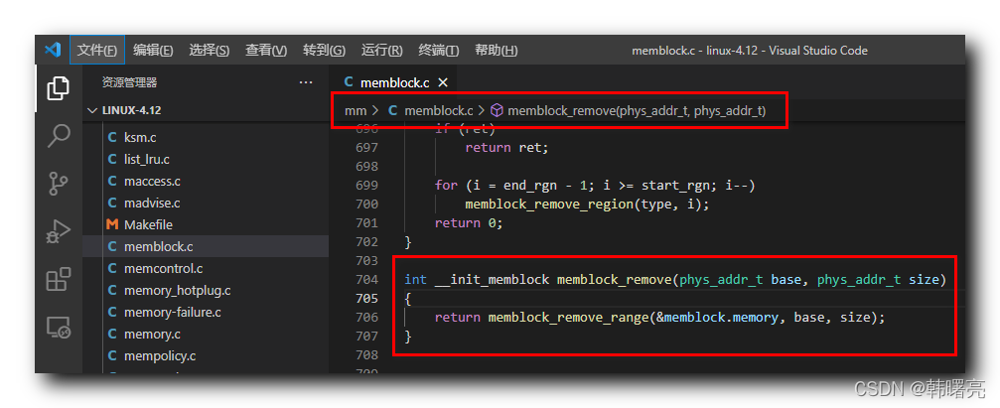

【Linux 内核 内存管理】memblock 分配器编程接口 ③ ( memblock_remove 函数 | memblock_remove_range 函数 )

#### 文章目录

-   [一、memblock\_remove 函数分析](https://cloud.tencent.com/developer?from_column=20421&from=20421)
-   [二、memblock\_remove\_range 函数分析](https://cloud.tencent.com/developer?from_column=20421&from=20421)
-   -   [1、memblock\_remove\_range 函数执行流程](https://cloud.tencent.com/developer?from_column=20421&from=20421)
    -   [2、memblock\_remove\_range 函数参数介绍](https://cloud.tencent.com/developer?from_column=20421&from=20421)
    -   [3、memblock\_remove\_range 函数源码](https://cloud.tencent.com/developer?from_column=20421&from=20421)

**memblock 分配器提供了如下编程接口 :**

**① 添加内存 :** `memblock_add` 函数 , 将 内存块区域 添加到 `memblock.memory` 成员中 , 即 插入一块可用的物理内存 ;

**② 删除内存 :** `memblock_remove` 函数 , 删除 内存块区域 ;

**③ 分配内存 :** `memblock_alloc` 函数 , 申请分配内存 ;

**④ 释放内存 :** `memblock_free` 函数 , 释放之前分配的内存 ;

在之前的博客中介绍了 `memblock_add` 函数源码 , 本篇博客开始介绍 `memblock_remove` 函数 ;

## 一、memblock\_remove 函数分析

* * *

`memblock_remove` 函数 的作用是 从 " 可用的物理内存区域 “ 中 删除 一块 ” 可用的物理内存区域 " ;

该函数有

22

个参数 :

-   `phys_addr_t base` 参数 表示 要删除的内存区域的 起始地址 ;
-   `phys_addr_t size` 参数 表示 要删除的内存区域的 大小 ;

`memblock_remove` 函数 定义在 linux-4.12\\mm\\memblock.c#704 位置 , 函数源码如下 :

代码语言：javascript

复制

    int __init_memblock memblock_remove(phys_addr_t base, phys_addr_t size)
    {
    	return memblock_remove_range(&memblock.memory, base, size);
    }

**源码路径 :** linux-4.12\\mm\\memblock.c#511

在这里插入图片描述

在上述 `memblock_remove` 函数中 , 调用了 `memblock_remove_range` 函数 ;

## 二、memblock\_remove\_range 函数分析

* * *

### 1、memblock\_remove\_range 函数执行流程

在 `memblock_remove_range` 函数中 ,

首先 , 计算出 要删除的 物理内存区域 的 终止地址 ,

如果 需要删除的 内存区域 可能与 内存区域 内的 内存块 有重叠 ,

调用 `memblock_isolate_range` 函数 , 将 重叠部分从 内存区域 中独立出来 ;

代码语言：javascript

复制

    	ret = memblock_isolate_range(type, base, size, &start_rgn, &end_rgn);
    	if (ret)
    		return ret;

**源码路径 :** linux-4.12\\mm\\memblock.c#695

然后 , 再调用 `memblock_remove_region` 函数 , 删除 指定区间的 物理内存区域 ;

先记录 重叠内存区域 的索引号 , 调用 `memblock_remove_region` 函数 , 删除 这些索引号对应的 内存区域 ;

代码语言：javascript

复制

    	for (i = end_rgn - 1; i >= start_rgn; i--)
    		memblock_remove_region(type, i);

**源码路径 :** linux-4.12\\mm\\memblock.c#699

### 2、memblock\_remove\_range 函数参数介绍

**`memblock_remove_range` 函数参数作用 :**

-   `struct memblock_type *type` 参数 指向 要删除 物理内存 的 内存区域 ;
-   `phys_addr_t base` 参数 表示 要删除的内存区域的 起始地址 ;
-   `phys_addr_t size` 参数 表示 要删除的内存区域的 大小 ;

### 3、memblock\_remove\_range 函数源码

`memblock_remove_range` 函数定义在 Linux 内核源码的 linux-4.12\\mm\\memblock.c#689 位置 ;

**`memblock_remove_range` 函数源码如下 :**

代码语言：javascript

复制

    static int __init_memblock memblock_remove_range(struct memblock_type *type,
    					  phys_addr_t base, phys_addr_t size)
    {
    	int start_rgn, end_rgn;
    	int i, ret;
    
    	ret = memblock_isolate_range(type, base, size, &start_rgn, &end_rgn);
    	if (ret)
    		return ret;
    
    	for (i = end_rgn - 1; i >= start_rgn; i--)
    		memblock_remove_region(type, i);
    	return 0;
    }

**源码路径 :** linux-4.12\\mm\\memblock.c#689

## 参考

[【Linux 内核 内存管理】memblock 分配器编程接口 ③ ( memblock_remove 函数 | memblock_remove_range 函数 )-腾讯云开发者社区-腾讯云 (tencent.com)](https://cloud.tencent.com/developer/article/2253532)