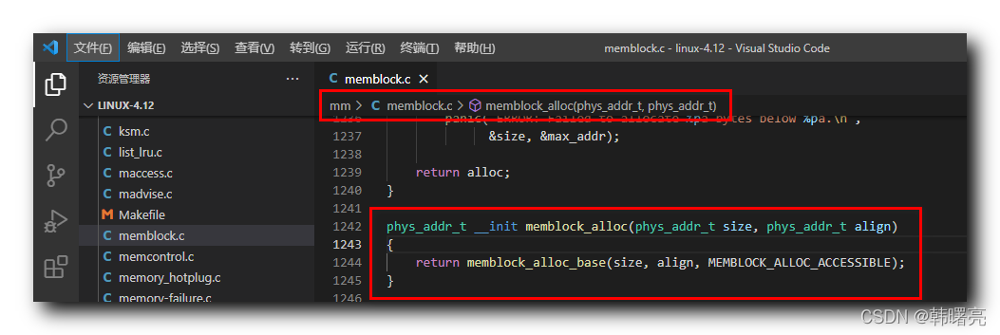

【Linux 内核 内存管理】memblock 分配器编程接口 ④ ( memblock_alloc 函数 | memblock_alloc_base 函数 )

#### 文章目录

-   [一、memblock\_alloc 函数分析](https://cloud.tencent.com/developer?from_column=20421&from=20421)
-   [二、memblock\_alloc\_base 函数分析](https://cloud.tencent.com/developer?from_column=20421&from=20421)
-   [三、\_\_memblock\_alloc\_base 函数分析](https://cloud.tencent.com/developer?from_column=20421&from=20421)
-   [四、memblock\_alloc\_base\_nid 函数分析](https://cloud.tencent.com/developer?from_column=20421&from=20421)
-   [五、memblock\_alloc\_range\_nid 函数分析](https://cloud.tencent.com/developer?from_column=20421&from=20421)

**memblock 分配器提供了如下编程接口 :**

**① 添加内存 :** `memblock_add` 函数 , 将 内存块区域 添加到 `memblock.memory` 成员中 , 即 插入一块可用的物理内存 ;

**② 删除内存 :** `memblock_remove` 函数 , 删除 内存块区域 ;

**③ 分配内存 :** `memblock_alloc` 函数 , 申请分配内存 ;

**④ 释放内存 :** `memblock_free` 函数 , 释放之前分配的内存 ;

在之前的博客中介绍了 `memblock_add` `memblock_remove` 函数源码 , 本篇博客开始介绍 `memblock_alloc` 分配内存函数 ;

## 一、memblock\_alloc 函数分析

* * *

`memblock_alloc` 函数 的作用是 在 指定地址之前 分配一块物理内存 ;

`memblock_alloc` 函数 定义在 Linux 内核源码的 linux-4.12\\mm\\memblock.c#1242 位置 ;

代码语言：javascript

复制

    phys_addr_t __init memblock_alloc(phys_addr_t size, phys_addr_t align)
    {
    	return memblock_alloc_base(size, align, MEMBLOCK_ALLOC_ACCESSIBLE);
    }

**源码路径 :** linux-4.12\\mm\\memblock.c#1242

在这里插入图片描述

在 `memblock_alloc` 函数 中 , 调用了 `memblock_alloc_base` 函数 ;

## 二、memblock\_alloc\_base 函数分析

* * *

在 `memblock_alloc_base` 函数 中 , 调用了 `__memblock_alloc_base` 函数 ,

目的是 获取一块 可用物理内存 , 如果执行成功 , 则获取的 物理内存区域 首地址为

00

;

**`memblock_alloc_base` 函数参数说明 :**

-   `phys_addr_t size` 参数 用于 指明要分配的 物理内存大小 ;
-   `phys_addr_t align` 参数 表示 对齐方式 ;
-   `phys_addr_t max_addr` 参数 表示 可分配物理地址的 最大值 , 也就是说必须在该地址之前分配 物理内存 ;

代码语言：javascript

复制

    phys_addr_t __init memblock_alloc_base(phys_addr_t size, phys_addr_t align, phys_addr_t max_addr)
    {
    	phys_addr_t alloc;
    
    	alloc = __memblock_alloc_base(size, align, max_addr);
    
    	if (alloc == 0)
    		panic("ERROR: Failed to allocate %pa bytes below %pa.\n",
    		      &size, &max_addr);
    
    	return alloc;
    }

**源码路径 :** linux-4.12\\mm\\memblock.c#1230

## 三、\_\_memblock\_alloc\_base 函数分析

* * *

在 `__memblock_alloc_base` 函数 中 , 调用了 `memblock_alloc_base_nid` 函数 ;

**`__memblock_alloc_base` 函数参数说明 :**

-   `phys_addr_t size` 参数 用于 指明要分配的 物理内存大小 ;
-   `phys_addr_t align` 参数 表示 对齐方式 ;
-   `phys_addr_t max_addr` 参数 表示 可分配物理地址的 最大值 , 也就是说必须在该地址之前分配 物理内存 ;

代码语言：javascript

复制

    phys_addr_t __init __memblock_alloc_base(phys_addr_t size, phys_addr_t align, phys_addr_t max_addr)
    {
    	return memblock_alloc_base_nid(size, align, max_addr, NUMA_NO_NODE,
    				       MEMBLOCK_NONE);
    }

**源码路径 :** linux-4.12\\mm\\memblock.c#1223

## 四、memblock\_alloc\_base\_nid 函数分析

* * *

在 `memblock_alloc_base_nid` 函数 中 , 调用了 `memblock_alloc_range_nid` 函数 ;

**`memblock_alloc_base_nid` 函数参数说明 :**

-   `phys_addr_t size` 参数 用于 指明要分配的 物理内存大小 ;
-   `phys_addr_t align` 参数 表示 对齐方式 ;
-   `phys_addr_t max_addr` 参数 表示 可分配物理地址的 最大值 , 也就是说必须在该地址之前分配 物理内存 ;
-   `int nid` 参数 表示 新区域的 nid , 指向 NUMA 结构 ;
-   `unsigned long flags` 参数 表示 新加入 内存块 的 标志位 ;

代码语言：javascript

复制

    static phys_addr_t __init memblock_alloc_base_nid(phys_addr_t size,
    					phys_addr_t align, phys_addr_t max_addr,
    					int nid, ulong flags)
    {
    	return memblock_alloc_range_nid(size, align, 0, max_addr, nid, flags);
    }

**源码路径 :** linux-4.12\\mm\\memblock.c#1200

## 五、memblock\_alloc\_range\_nid 函数分析

* * *

**`memblock_alloc_range_nid` 函数参数说明 :**

-   `phys_addr_t size` 参数 用于 指明要分配的 物理内存大小 ;
-   `phys_addr_t align` 参数 表示 对齐方式 ;
-   `phys_addr_t start` 参数 用于 指明要分配的 物理内存 起始地址 ;
-   `phys_addr_t end` 参数 用于 指明要分配的 物理内存 结束地址 ;
-   `int nid` 参数 表示 新区域的 nid , 指向 NUMA 结构 ;
-   `unsigned long flags` 参数 表示 新加入 内存块 的 标志位 ;

`memblock_alloc_range_nid` 函数源码如下 :

代码语言：javascript

复制

    static phys_addr_t __init memblock_alloc_range_nid(phys_addr_t size,
    					phys_addr_t align, phys_addr_t start,
    					phys_addr_t end, int nid, ulong flags)
    {
    	phys_addr_t found;
    
    	if (!align)
    		align = SMP_CACHE_BYTES;
    
    	found = memblock_find_in_range_node(size, align, start, end, nid,
    					    flags);
    	if (found && !memblock_reserve(found, size)) {
    		/*
    		 * The min_count is set to 0 so that memblock allocations are
    		 * never reported as leaks.
    		 */
    		kmemleak_alloc_phys(found, size, 0, 0);
    		return found;
    	}
    	return 0;
    }

**源码路径 :** linux-4.12\\mm\\memblock.c#1170

## 参考

[【Linux 内核 内存管理】memblock 分配器编程接口 ④ ( memblock_alloc 函数 | memblock_alloc_base 函数 )-腾讯云开发者社区-腾讯云 (tencent.com)](https://cloud.tencent.com/developer/article/2253533)