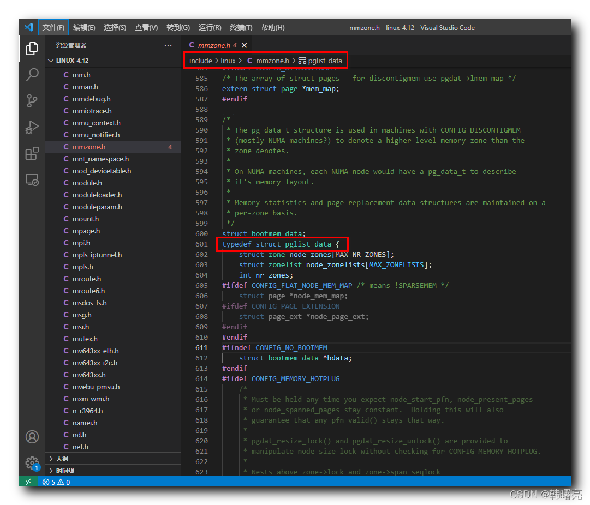
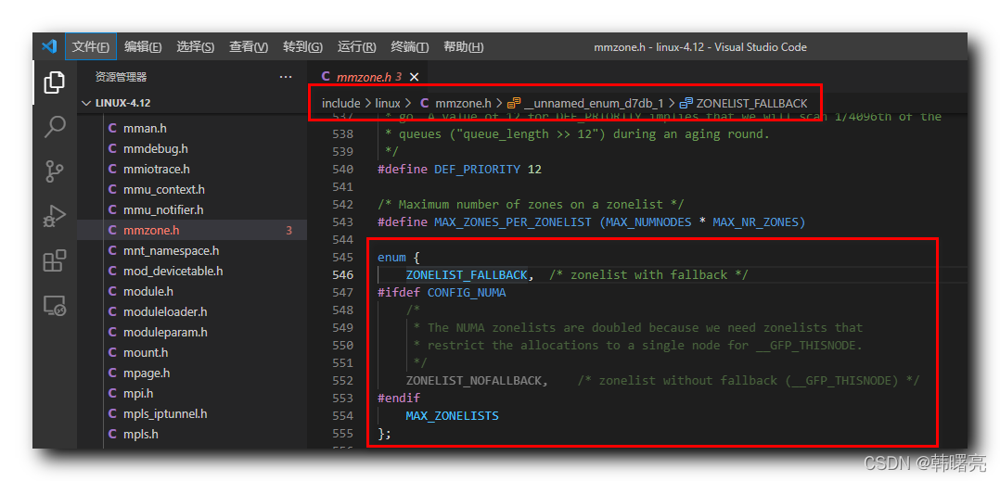
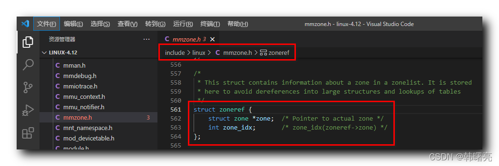

【Linux 内核 内存管理】分区伙伴分配器 ③ ( 备用内存区域列表 | ZONELIST_FALLBACK 枚举 | zoneref 结构体 | 备用内存区域借用物理页规则 )

#### 文章目录

-   [一、备用内存区域列表](https://cloud.tencent.com/developer?from_column=20421&from=20421)
-   [二、ZONELIST\_FALLBACK、ZONELIST\_NOFALLBACK 枚举](https://cloud.tencent.com/developer?from_column=20421&from=20421)
-   [三、zoneref 结构体](https://cloud.tencent.com/developer?from_column=20421&from=20421)
-   [四、备用内存区域借用物理页规则](https://cloud.tencent.com/developer?from_column=20421&from=20421)

## 一、备用内存区域列表

* * *

假如 首选 内存节点 或 内存区域 不能满足 内存分配请求 ,

就需要从 " 备用内存区域 " 借用 物理页 进行 内存分配 , 该操作需要遵守如下算法规则 ;

" 内存节点 " 使用 `pglist_data` 结构体 进行描述 , 该结构体定义在 Linux 内核源码中的 linux-4.12\\include\\linux\\mmzone.h#601 位置 ;

`pglist_data` 结构体中的 `struct zone node_zones[MAX_NR_ZONES]` 成员是 内存区域 数组 , `struct zonelist node_zonelists[MAX_ZONELISTS]` 成员是 **备用内存区域列表** ;

代码语言：javascript

复制

    typedef struct pglist_data {
    	struct zone node_zones[MAX_NR_ZONES];
    	struct zonelist node_zonelists[MAX_ZONELISTS];
    }pg_data_t;

**源码路径 :** linux-4.12\\include\\linux\\mmzone.h#601

在这里插入图片描述

## 二、ZONELIST\_FALLBACK、ZONELIST\_NOFALLBACK 枚举

* * *

UMA 系统中 , 有

11

个备用区域列表 , 内部的备用区域 按照 区域类型 , 由高到低 进行排序 ;

如 : 该 UMA 系统有 " 普通区域 " , " DMA 区域 " , 那么备用区域列表如下 { 普通区域 , DMA 区域 } ;

UMA 系统的 每个 内存节点中 , 都有

22

个 备用内存区域列表 ,

-   一个包含了 所有内存节点 的 备用内存区域列表 ,
-   另外一个 包含了 当前内存节点 的 备用区域列表 ;

`ZONELIST_FALLBACK` 枚举 包含了 所有内存节点 的 备用内存区域列表 ;

`ZONELIST_NOFALLBACK` 枚举 包含了当 前内存节点 的 备用区域列表 ;

代码语言：javascript

复制

    enum {
    	ZONELIST_FALLBACK,	/* zonelist with fallback */
    #ifdef CONFIG_NUMA
    	/*
    	 * The NUMA zonelists are doubled because we need zonelists that
    	 * restrict the allocations to a single node for __GFP_THISNODE.
    	 */
    	ZONELIST_NOFALLBACK,	/* zonelist without fallback (__GFP_THISNODE) */
    #endif
    	MAX_ZONELISTS
    };

**源码路径 :** linux-4.12\\include\\linux\\mmzone.h#545

在这里插入图片描述

## 三、zoneref 结构体

* * *

`struct zone *zone` 成员 指向 内存区域 数据结构 ;

`int zone_idx` 成员 指向 内存区域 的 类型 ;

代码语言：javascript

复制

    /*
     * This struct contains information about a zone in a zonelist. It is stored
     * here to avoid dereferences into large structures and lookups of tables
     */
    struct zoneref {
    	struct zone *zone;	/* Pointer to actual zone */
    	int zone_idx;		/* zone_idx(zoneref->zone) */
    };

**源码路径 :** linux-4.12\\include\\linux\\mmzone.h#561

在这里插入图片描述

## 四、备用内存区域借用物理页规则

* * *

**从 " 备用内存区域 " 借用 物理页 规则 :**

**① 相同类型区域借用物理页 :** 内存节点 的 指定类型区域 可以从 另一个 内存节点 相同类型区域 借用 物理页 ,

如 : 内存节点

AA

普通区域 从 内存节点

BB

的普通区域 借用物理页 ;

**② 高类型借用低类型区域 :** 高区域类型 从 低区域类型 借用 物理页 ,

如 : 普通区域 向 DMA 区域 借用 物理页 ;

**注意 :** 低类型区域 无法从 高类型区域 借用 物理页 ; 如 : DMA 区域 无法从 普通区域 借用物理页 ;

## 参考

[【Linux 内核 内存管理】分区伙伴分配器 ③ ( 备用内存区域列表 | ZONELIST_FALLBACK 枚举 | zoneref 结构体 | 备用内存区域借用物理页规则 )-腾讯云开发者社区-腾讯云 (tencent.com)](https://cloud.tencent.com/developer/article/2253541)