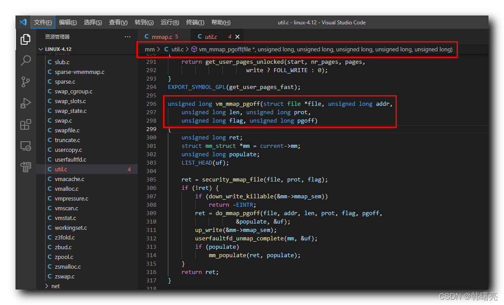

#### 文章目录

-   [一、vm\_mmap\_pgoff 函数执行流程](https://cloud.tencent.com/developer?from_column=20421&from=20421)
-   [二、vm\_mmap\_pgoff 函数源码](https://cloud.tencent.com/developer?from_column=20421&from=20421)

调用 `mmap` 系统调用 , 先检查 " 偏移 " 是否是 " 内存页大小 " 的 " 整数倍 " , 如果偏移是内存页大小的整数倍 , 则调用 `sys_mmap_pgoff` 函数 , 继续向下执行 ;

在 `sys_mmap_pgoff` 系统调用函数 中 , 最后调用了 `vm_mmap_pgoff` 函数 , 继续向下执行 ;

## 一、vm\_mmap\_pgoff 函数执行流程

* * *

在 `vm_mmap_pgoff` 函数中 ,

**首先** , 以 " 写者 " 身份 , 向 Linux 内核申请 读写 " 信号量 " 权限 ;

**然后** , 如果 读写 " 信号量 " 权限 申请通过 , 那么调用 `do_mmap_pgoff` 函数 , 执行 创建 " 内存映射 " 的过程 , 特别注意 , 这是 创建 " 内存映射 " 的 核心函数 , 下一篇博客着重讲该函数 ;

**再后** , 创建 " 内存映射 " 完成后 , 释放 " 读写信号量 " ;

**最后** , 处理 " 内存页 " 锁定问题 , 如果需要将 内存映射 的 内存页 锁定在 虚拟内存 中 , 直接进行处理即可 , 在 物理地址空间 分配 内存页 , 并将 虚拟地址空间 的 内存页 映射到 物理内存页 中 ;

## 二、vm\_mmap\_pgoff 函数源码

* * *

`vm_mmap_pgoff` 函数定义在 Linux 内核源码中的 linux-4.12\\mm\\util.c#296 位置 ;

**`vm_mmap_pgoff` 函数源码如下 :**

代码语言：javascript

复制

    unsigned long vm_mmap_pgoff(struct file *file, unsigned long addr,
    	unsigned long len, unsigned long prot,
    	unsigned long flag, unsigned long pgoff)
    {
    	unsigned long ret;
    	struct mm_struct *mm = current->mm;
    	unsigned long populate;
    	LIST_HEAD(uf);
    
    	ret = security_mmap_file(file, prot, flag);
    	if (!ret) {
    		if (down_write_killable(&mm->mmap_sem))
    			return -EINTR;
    		ret = do_mmap_pgoff(file, addr, len, prot, flag, pgoff,
    				    &populate, &uf);
    		up_write(&mm->mmap_sem);
    		userfaultfd_unmap_complete(mm, &uf);
    		if (populate)
    			mm_populate(ret, populate);
    	}
    	return ret;
    }

**源码路径 :** linux-4.12\\mm\\util.c#296

## 参考

[【Linux 内核 内存管理】mmap 系统调用源码分析 ③ ( vm_mmap_pgoff 函数执行流程 | vm_mmap_pgoff 函数源码 )-腾讯云开发者社区-腾讯云 (tencent.com)](https://cloud.tencent.com/developer/article/2253490)