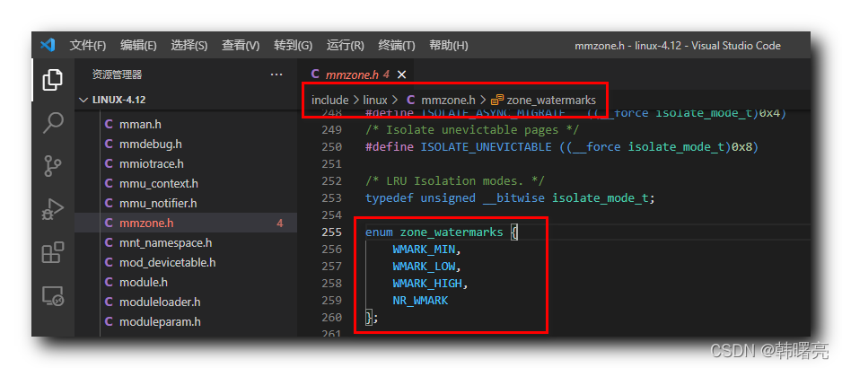
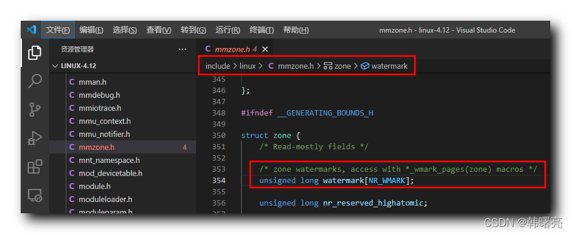

【Linux 内核 内存管理】分区伙伴分配器 ⑤ ( 区域水线 | 区域水线数据结构 zone_watermarks 枚举 | 内存区域 zone 中的区域水线 watermark 成员 )

#### 文章目录

-   [一、区域水线](https://cloud.tencent.com/developer?from_column=20421&from=20421)
-   [二、区域水线数据结构 zone\_watermarks 枚举 ( WMARK\_MIN | WMARK\_LOW | WMARK\_HIGH | NR\_WMARK )](https://cloud.tencent.com/developer?from_column=20421&from=20421)
-   [三、内存区域 zone 中的区域水线 watermark 成员](https://cloud.tencent.com/developer?from_column=20421&from=20421)

## 一、区域水线

* * *

" 首选内存区域 “ 在特定情况下 从 ” 备用内存区域 “ 借用物理内存 , 该 " 特定情况 " 与 ” 区域水线 " 有关 ;

**每个 " 内存区域 " 都有**

33

**条水线 :**

**① 高水线 :** High Water Marker , 内存区域 空闲页数 大于 高水线 , 内存充足 ;

**② 低水线 :** Low Water Marker , 内存区域 空闲页数 小于 低水线 , 内存轻微不足 ;

**③ 最低水线 :** Min Water Marker , 内存区域 空闲页数 小于 最低水线 , 内存严重不足 ;

最低水线以下的内存是 " 紧急保留内存 “ , 只有在内存严重不足的情况下 , 才会分配给 特定进程 , 这些进程的必须承若 ” 分配少量内存 , 释放更多内存 " ;

## 二、区域水线数据结构 zone\_watermarks 枚举 ( WMARK\_MIN | WMARK\_LOW | WMARK\_HIGH | NR\_WMARK )

* * *

区域水线对应的数据结构 定义在 linux 内核源码的 linux-4.12\\include\\linux\\mmzone.h#255 位置 , 是一个枚举 ;

代码语言：javascript

复制

    enum zone_watermarks {
    	WMARK_MIN,
    	WMARK_LOW,
    	WMARK_HIGH,
    	NR_WMARK
    };

**源码路径 :** linux-4.12\\include\\linux\\mmzone.h#255

在这里插入图片描述

## 三、内存区域 zone 中的区域水线 watermark 成员

* * *

" 内存区域 " `struct zone` 结构体中的 `unsigned long watermark[NR_WMARK];` 成员是 内存区域 中 " 页分配器 " 使用的 区域水线 ;

代码语言：javascript

复制

    struct zone {
    	/* Read-mostly fields */
    
    	/* zone watermarks, access with *_wmark_pages(zone) macros */
    	unsigned long watermark[NR_WMARK];
    }

**源码路径 :** linux-4.12\\include\\linux\\mmzone.h#354

## 参考

[【Linux 内核 内存管理】分区伙伴分配器 ⑤ ( 区域水线 | 区域水线数据结构 zone_watermarks 枚举 | 内存区域 zone 中的区域水线 watermark 成员 )-腾讯云开发者社区-腾讯云 (tencent.com)](https://cloud.tencent.com/developer/article/2253543)