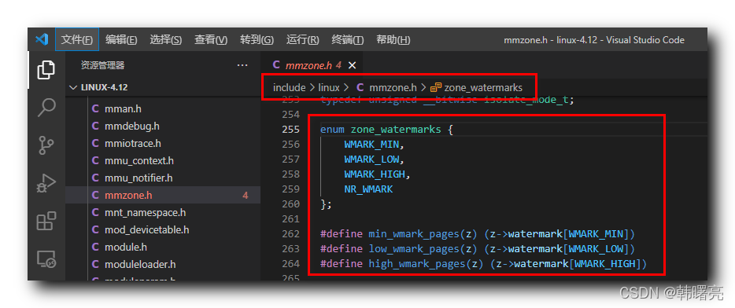
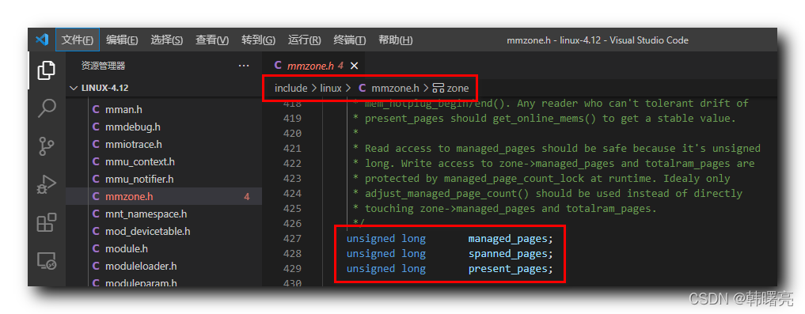
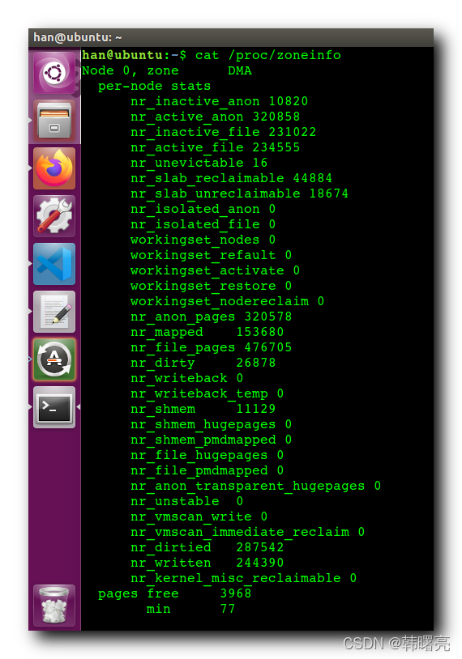
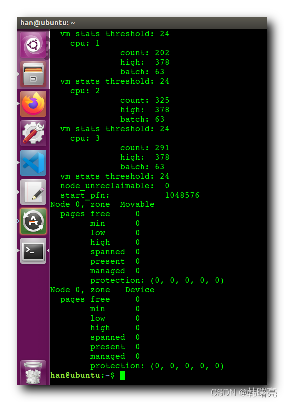

【Linux 内核 内存管理】分区伙伴分配器 ⑥ ( zone 结构体中水线控制相关成员 | 在 Ubuntu 中查看内存区域水位线 )

#### 文章目录

-   [一、zone 结构体中水线控制相关成员 ( managed\_pages | spanned\_pages | present\_pages )](https://cloud.tencent.com/developer?from_column=20421&from=20421)
-   [二、在 Ubuntu 中查看内存区域水位线](https://cloud.tencent.com/developer?from_column=20421&from=20421)

上一篇博客 [【Linux 内核 内存管理】分区伙伴分配器 ⑤ ( 区域水线 | 区域水线数据结构 zone\_watermarks 枚举 | 内存区域 zone 中的区域水线 watermark 成员 )](https://cloud.tencent.com/developer/article/2253543?from_column=20421&from=20421) 中讲解了 区域水线概念 , 本篇博客中开始分析 根据水线 进行 水位控制 的机制 ;

`WMARK_HIGH` 高水位 , `WMARK_LOW` 低水位 , `WMARK_MIN` 最低水位 ,

33

个水位线 , 将 " 内存区域 " 分割成

44

部分 ;

代码语言：javascript

复制

    enum zone_watermarks {
    	WMARK_MIN,
    	WMARK_LOW,
    	WMARK_HIGH,
    	NR_WMARK
    };
    
    #define min_wmark_pages(z) (z->watermark[WMARK_MIN])
    #define low_wmark_pages(z) (z->watermark[WMARK_LOW])
    #define high_wmark_pages(z) (z->watermark[WMARK_HIGH])

**源码路径 :** linux-4.12\\include\\linux\\mmzone.h#255

## 一、zone 结构体中水线控制相关成员 ( managed\_pages | spanned\_pages | present\_pages )

* * *

在 linux 内核源码中 描述 " 内存区域 " 的结构体 `struct zone` 中 , 有几个重要的参数 , 用于 控制 区域水线水位 :

`managed_pages` 成员 表示 伙伴分配器 管理的 物理页个数 ; 使用 如下 公式进行计算 :

zone\_end\_pfn−zone\_start\_pfn\\rm zone\\\_end\\\_pfn - zone\\\_start\\\_pfn

`spanned_pages` 成员 表示 内存区域 的 所有可用物理页 个数 , 包括 内存空洞 ; 使用 如下 公式进行计算 :

spanned\_pages−hole\_pages\\rm spanned\\\_pages - hole\\\_pages

`present_pages` 成员 表示 当前 内存区域 的 物理页个数 , 不包括 内存空洞 ; 是通过 伙伴分配器 管理的 物理页 ; 使用 如下 公式进行计算 :

present\_pages−reserved\_pages\\rm present\\\_pages - reserved\\\_pages

`present_pages`、 `spanned_pages`、 `managed_pages` **三者之间有如下关系** :

`spanned_pages` ( 内存区域所有可用物理页数 有空洞 ) >

`present_pages` ( 当前区域物理页数 无空洞 ) >

`managed_pages` ( 伙伴分配器管理的物理页数 )

参考 [【Linux 内核 内存管理】物理内存组织结构 ④ ( 内存区域 zone 简介 | zone 结构体源码分析 | zone 结构体源码 )](https://cloud.tencent.com/developer/tools/blog-entry?target=https%3A%2F%2Fblog.csdn.net%2Fshulianghan%2Farticle%2Fdetails%2F124256224&source=article&objectId=2253545) 博客 ;

**`struct zone`** **结构体相关源码 :**

代码语言：javascript

复制

    struct zone {
    	/* Read-mostly fields */
    
    	/* zone watermarks, access with *_wmark_pages(zone) macros */
    	unsigned long watermark[NR_WMARK];
    	...
    	
    	unsigned long		managed_pages;
    	unsigned long		spanned_pages;
    	unsigned long		present_pages;
    	...
    }

**源码路径 :** linux-4.12\\include\\linux\\mmzone.h#427

## 二、在 Ubuntu 中查看内存区域水位线

* * *

在 Ubuntu 的 命令行 中 , 执行

代码语言：javascript

复制

    cat /proc/zoneinfo

命令 , 查看 " 内存区域 " 信息 ;

输出内容中 , 其中 **Normal 区域的信息如下 :**

代码语言：javascript

复制

    Node 0, zone   Normal
      pages free     5754
            min      4615
            low      5768
            high     6921
            spanned  262144
            present  262144
            managed  236760
            protection: (0, 0, 0, 0, 0)

**DMA32 区域的信息如下 :**

代码语言：javascript

复制

    Node 0, zone    DMA32
      pages free     43834
            min      12202
            low      15252
            high     18302
            spanned  1044480
            present  782288
            managed  759709
            protection: (0, 0, 924, 924, 924)

**DMA 区域的信息如下 :**

代码语言：javascript

复制

    Node 0, zone      DMA
      per-node stats
          nr_inactive_anon 10820
          nr_active_anon 320858
          nr_inactive_file 231022
          nr_active_file 234555
          nr_unevictable 16
          nr_slab_reclaimable 44884
          nr_slab_unreclaimable 18674
          nr_isolated_anon 0
          nr_isolated_file 0

**输出完整内容 :**

代码语言：javascript

复制

    han@ubuntu:~$ cat /proc/zoneinfo
    Node 0, zone      DMA
      per-node stats
          nr_inactive_anon 10820
          nr_active_anon 320858
          nr_inactive_file 231022
          nr_active_file 234555
          nr_unevictable 16
          nr_slab_reclaimable 44884
          nr_slab_unreclaimable 18674
          nr_isolated_anon 0
          nr_isolated_file 0
          workingset_nodes 0
          workingset_refault 0
          workingset_activate 0
          workingset_restore 0
          workingset_nodereclaim 0
          nr_anon_pages 320578
          nr_mapped    153680
          nr_file_pages 476705
          nr_dirty     26878
          nr_writeback 0
          nr_writeback_temp 0
          nr_shmem     11129
          nr_shmem_hugepages 0
          nr_shmem_pmdmapped 0
          nr_file_hugepages 0
          nr_file_pmdmapped 0
          nr_anon_transparent_hugepages 0
          nr_unstable  0
          nr_vmscan_write 0
          nr_vmscan_immediate_reclaim 0
          nr_dirtied   287542
          nr_written   244390
          nr_kernel_misc_reclaimable 0
      pages free     3968
            min      77
            low      96
            high     115
            spanned  4095
            present  3997
            managed  3976
            protection: (0, 2445, 3369, 3369, 3369)
          nr_free_pages 3968
          nr_zone_inactive_anon 0
          nr_zone_active_anon 0
          nr_zone_inactive_file 0
          nr_zone_active_file 0
          nr_zone_unevictable 0
          nr_zone_write_pending 0
          nr_mlock     0
          nr_page_table_pages 0
          nr_kernel_stack 0
          nr_bounce    0
          nr_zspages   0
          nr_free_cma  0
          numa_hit     1
          numa_miss    0
          numa_foreign 0
          numa_interleave 0
          numa_local   1
          numa_other   0
      pagesets
        cpu: 0
                  count: 0
                  high:  0
                  batch: 1
      vm stats threshold: 6
        cpu: 1
                  count: 0
                  high:  0
                  batch: 1
      vm stats threshold: 6
        cpu: 2
                  count: 0
                  high:  0
                  batch: 1
      vm stats threshold: 6
        cpu: 3
                  count: 0
                  high:  0
                  batch: 1
      vm stats threshold: 6
      node_unreclaimable:  0
      start_pfn:           1
    Node 0, zone    DMA32
      pages free     43834
            min      12202
            low      15252
            high     18302
            spanned  1044480
            present  782288
            managed  759709
            protection: (0, 0, 924, 924, 924)
          nr_free_pages 43834
          nr_zone_inactive_anon 8454
          nr_zone_active_anon 245858
          nr_zone_inactive_file 181846
          nr_zone_active_file 177532
          nr_zone_unevictable 4
          nr_zone_write_pending 26534
          nr_mlock     4
          nr_page_table_pages 5641
          nr_kernel_stack 8472
          nr_bounce    0
          nr_zspages   0
          nr_free_cma  0
          numa_hit     4159869
          numa_miss    0
          numa_foreign 0
          numa_interleave 192366
          numa_local   4159869
          numa_other   0
      pagesets
        cpu: 0
                  count: 50
                  high:  378
                  batch: 63
      vm stats threshold: 36
        cpu: 1
                  count: 335
                  high:  378
                  batch: 63
      vm stats threshold: 36
        cpu: 2
                  count: 300
                  high:  378
                  batch: 63
      vm stats threshold: 36
        cpu: 3
                  count: 121
                  high:  378
                  batch: 63
      vm stats threshold: 36
      node_unreclaimable:  0
      start_pfn:           4096
    Node 0, zone   Normal
      pages free     5754
            min      4615
            low      5768
            high     6921
            spanned  262144
            present  262144
            managed  236760
            protection: (0, 0, 0, 0, 0)
          nr_free_pages 5754
          nr_zone_inactive_anon 2366
          nr_zone_active_anon 75000
          nr_zone_inactive_file 49176
          nr_zone_active_file 57023
          nr_zone_unevictable 12
          nr_zone_write_pending 344
          nr_mlock     12
          nr_page_table_pages 5556
          nr_kernel_stack 7096
          nr_bounce    0
          nr_zspages   0
          nr_free_cma  0
          numa_hit     839519
          numa_miss    0
          numa_foreign 0
          numa_interleave 223408
          numa_local   839519
          numa_other   0
      pagesets
        cpu: 0
                  count: 253
                  high:  378
                  batch: 63
      vm stats threshold: 24
        cpu: 1
                  count: 202
                  high:  378
                  batch: 63
      vm stats threshold: 24
        cpu: 2
                  count: 325
                  high:  378
                  batch: 63
      vm stats threshold: 24
        cpu: 3
                  count: 291
                  high:  378
                  batch: 63
      vm stats threshold: 24
      node_unreclaimable:  0
      start_pfn:           1048576
    Node 0, zone  Movable
      pages free     0
            min      0
            low      0
            high     0
            spanned  0
            present  0
            managed  0
            protection: (0, 0, 0, 0, 0)
    Node 0, zone   Device
      pages free     0
            min      0
            low      0
            high     0
            spanned  0
            present  0
            managed  0
            protection: (0, 0, 0, 0, 0)
    han@ubuntu:~$ 

## 参考

[【Linux 内核 内存管理】分区伙伴分配器 ⑥ ( zone 结构体中水线控制相关成员 | 在 Ubuntu 中查看内存区域水位线 )-腾讯云开发者社区-腾讯云 (tencent.com)](https://cloud.tencent.com/developer/article/2253545)