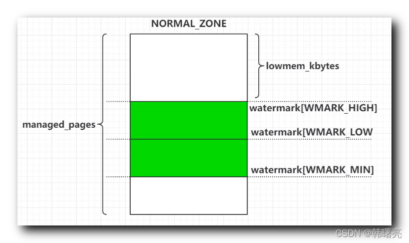
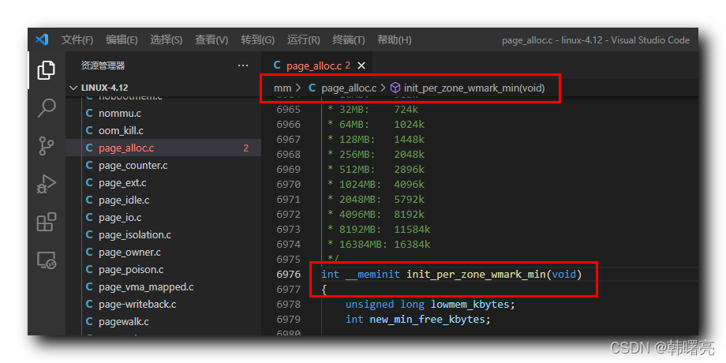

【Linux 内核 内存管理】分区伙伴分配器 ⑦ ( z-＞watermark[WMARK_MIN] 最低水位计算 | min_free_kbytes 初始化 )

#### 文章目录

-   [一、z->watermark\[WMARK\_MIN\] 最低水位计算](https://cloud.tencent.com/developer?from_column=20421&from=20421)
-   [二、min\_free\_kbytes 初始化过程](https://cloud.tencent.com/developer?from_column=20421&from=20421)
-   [三、最低水位计算过程](https://cloud.tencent.com/developer?from_column=20421&from=20421)
-   [四、nr\_free\_buffer\_pages 函数原型](https://cloud.tencent.com/developer?from_column=20421&from=20421)
-   [五、nr\_free\_zone\_pages 函数原型](https://cloud.tencent.com/developer?from_column=20421&from=20421)

## 一、z->watermark\[WMARK\_MIN\] 最低水位计算

* * *

在 内存区域 的水位控制机制 中 , 在 内存区域 `zone` 结构体中的 `watermark` 成员 表示 " 页分配器 " 使用的 区域水线 ;

代码语言：javascript

复制

    struct zone {
    	/* Read-mostly fields */
    
    	/* zone watermarks, access with *_wmark_pages(zone) macros */
    	unsigned long watermark[NR_WMARK];
    }

**源码路径 :** linux-4.12\\include\\linux\\mmzone.h#255

其中涉及到的 `NR_WMARK` 值为

44

, 定义在如下枚举数据结构中 ,

代码语言：javascript

复制

    enum zone_watermarks {
    	WMARK_MIN,
    	WMARK_LOW,
    	WMARK_HIGH,
    	NR_WMARK
    };
    
    #define min_wmark_pages(z) (z->watermark[WMARK_MIN])
    #define low_wmark_pages(z) (z->watermark[WMARK_LOW])
    #define high_wmark_pages(z) (z->watermark[WMARK_HIGH])

**源码路径 :** linux-4.12\\include\\linux\\mmzone.h#255

其中 `min_wmark_pages(z)` 宏定义对应的 `z->watermark[WMARK_MIN]` 需要通过 `min_free_kbytes` 值进行计算 ,

`min_free_kbytes` 表示 " 系统保留的最低空闲内存数 " ,

## 二、min\_free\_kbytes 初始化过程

* * *

`min_free_kbytes` 值在 `init_per_zone_wmark_min` 函数中进行初始化 ,

`lowmem_kbytes` 用于统计 低内存 中超过 高水位 物理页的个数 ;

**`lowmem_kbytes` 是** **高水位线 之上的内存** ;

**内存区域 的 整体 物理页个数 是 zone 结构体中的 `managed_pages` 成员 ;**

下图是整个内存区域的图 ;

在这里插入图片描述

代码语言：javascript

复制

    	lowmem_kbytes = nr_free_buffer_pages() * (PAGE_SIZE >> 10);
    	new_min_free_kbytes = int_sqrt(lowmem_kbytes * 16);

`min_free_kbytes` 值的范围是

128128

~

6553565535

;

代码语言：javascript

复制

    	if (new_min_free_kbytes > user_min_free_kbytes) {
    		min_free_kbytes = new_min_free_kbytes;
    		if (min_free_kbytes < 128)
    			min_free_kbytes = 128;
    		if (min_free_kbytes > 65536)
    			min_free_kbytes = 65536;
    	} 

**`init_per_zone_wmark_min` 函数源码如下 :**

代码语言：javascript

复制

    /*
     * Initialise min_free_kbytes.
     *
     * For small machines we want it small (128k min).  For large machines
     * we want it large (64MB max).  But it is not linear, because network
     * bandwidth does not increase linearly with machine size.  We use
     *
     *	min_free_kbytes = 4 * sqrt(lowmem_kbytes), for better accuracy:
     *	min_free_kbytes = sqrt(lowmem_kbytes * 16)
     *
     * which yields
     *
     * 16MB:	512k
     * 32MB:	724k
     * 64MB:	1024k
     * 128MB:	1448k
     * 256MB:	2048k
     * 512MB:	2896k
     * 1024MB:	4096k
     * 2048MB:	5792k
     * 4096MB:	8192k
     * 8192MB:	11584k
     * 16384MB:	16384k
     */
    int __meminit init_per_zone_wmark_min(void)
    {
    	unsigned long lowmem_kbytes;
    	int new_min_free_kbytes;
    
    	lowmem_kbytes = nr_free_buffer_pages() * (PAGE_SIZE >> 10);
    	new_min_free_kbytes = int_sqrt(lowmem_kbytes * 16);
    
    	if (new_min_free_kbytes > user_min_free_kbytes) {
    		min_free_kbytes = new_min_free_kbytes;
    		if (min_free_kbytes < 128)
    			min_free_kbytes = 128;
    		if (min_free_kbytes > 65536)
    			min_free_kbytes = 65536;
    	} else {
    		pr_warn("min_free_kbytes is not updated to %d because user defined value %d is preferred\n",
    				new_min_free_kbytes, user_min_free_kbytes);
    	}
    	setup_per_zone_wmarks();
    	refresh_zone_stat_thresholds();
    	setup_per_zone_lowmem_reserve();
    
    #ifdef CONFIG_NUMA
    	setup_min_unmapped_ratio();
    	setup_min_slab_ratio();
    #endif
    
    	return 0;
    }

**源码路径 :** linux-4.12\\mm\\page\_alloc.c#6976

在这里插入图片描述

## 三、最低水位计算过程

* * *

先调用 linux-4.12\\mm\\page\_alloc.c#4331 位置的 `nr_free_buffer_pages` 函数 ,

代码语言：javascript

复制

    /**
     * nr_free_buffer_pages - count number of pages beyond high watermark
     *
     * nr_free_buffer_pages() counts the number of pages which are beyond the high
     * watermark within ZONE_DMA and ZONE_NORMAL.
     */
    unsigned long nr_free_buffer_pages(void)

在该函数中调用了 linux-4.12\\mm\\page\_alloc.c#4305 位置的 `nr_free_zone_pages` 函数 ;

代码语言：javascript

复制

    /**
     * nr_free_zone_pages - count number of pages beyond high watermark
     * @offset: The zone index of the highest zone
     *
     * nr_free_zone_pages() counts the number of counts pages which are beyond the
     * high watermark within all zones at or below a given zone index.  For each
     * zone, the number of pages is calculated as:
     *
     *     nr_free_zone_pages = managed_pages - high_pages
     */
    static unsigned long nr_free_zone_pages(int offset)

## 四、nr\_free\_buffer\_pages 函数原型

* * *

代码语言：javascript

复制

    /**
     * nr_free_buffer_pages - count number of pages beyond high watermark
     *
     * nr_free_buffer_pages() counts the number of pages which are beyond the high
     * watermark within ZONE_DMA and ZONE_NORMAL.
     */
    unsigned long nr_free_buffer_pages(void)
    {
    	return nr_free_zone_pages(gfp_zone(GFP_USER));
    }

**源码路径 :** linux-4.12\\mm\\page\_alloc.c#4331

## 五、nr\_free\_zone\_pages 函数原型

* * *

代码语言：javascript

复制

    /**
     * nr_free_zone_pages - count number of pages beyond high watermark
     * @offset: The zone index of the highest zone
     *
     * nr_free_zone_pages() counts the number of counts pages which are beyond the
     * high watermark within all zones at or below a given zone index.  For each
     * zone, the number of pages is calculated as:
     *
     *     nr_free_zone_pages = managed_pages - high_pages
     */
    static unsigned long nr_free_zone_pages(int offset)
    {
    	struct zoneref *z;
    	struct zone *zone;
    
    	/* Just pick one node, since fallback list is circular */
    	unsigned long sum = 0;
    
    	struct zonelist *zonelist = node_zonelist(numa_node_id(), GFP_KERNEL);
    
    	for_each_zone_zonelist(zone, z, zonelist, offset) {
    		unsigned long size = zone->managed_pages;
    		unsigned long high = high_wmark_pages(zone);
    		if (size > high)
    			sum += size - high;
    	}
    
    	return sum;
    }

**源码路径 :** linux-4.12\\mm\\page\_alloc.c#4305

## 参考

[【Linux 内核 内存管理】分区伙伴分配器 ⑦ ( z-＞watermark[WMARK_MIN\] 最低水位计算 | min_free_kbytes 初始化 )-腾讯云开发者社区-腾讯云 (tencent.com)](https://cloud.tencent.com/developer/article/2253547)