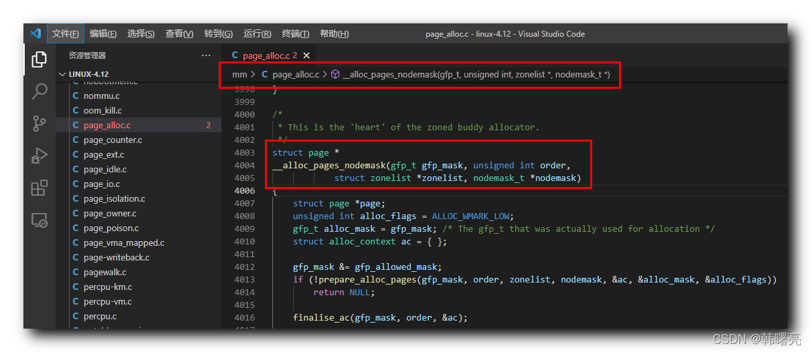

【Linux 内核 内存管理】物理分配页 ① ( 分区伙伴分配器物理分配页核心函数 __alloc_pages_nodemask | __alloc_pages_nodemask 函数完整源码 )

#### 文章目录

-   [一、分区伙伴分配器物理分配页核心函数 \_\_alloc\_pages\_nodemask](https://cloud.tencent.com/developer?from_column=20421&from=20421)
-   [二、\_\_alloc\_pages\_nodemask 函数完整源码](https://cloud.tencent.com/developer?from_column=20421&from=20421)

## 一、分区伙伴分配器物理分配页核心函数 \_\_alloc\_pages\_nodemask

* * *

Linux 内核中 , " 分区伙伴分配器 " 有多种 物理页分配函数 , 所有的 函数 都会调用 `__alloc_pages_nodemask` 函数 , 该函数是 物理页分配 的 核心函数 ;

`__alloc_pages_nodemask` 函数 定义在 Linux 内核源码的 linux-4.12\\mm\\page\_alloc.c#4003 位置 , 函数原型如下 :

代码语言：javascript

复制

    /*
     * This is the 'heart' of the zoned buddy allocator.
     */
    struct page *
    __alloc_pages_nodemask(gfp_t gfp_mask, unsigned int order,
    			struct zonelist *zonelist, nodemask_t *nodemask)

**源码路径 :** linux-4.12\\mm\\page\_alloc.c#4003

在这里插入图片描述

## 二、\_\_alloc\_pages\_nodemask 函数完整源码

* * *

代码语言：javascript

复制

    /*
     * This is the 'heart' of the zoned buddy allocator.
     */
    struct page *
    __alloc_pages_nodemask(gfp_t gfp_mask, unsigned int order,
    			struct zonelist *zonelist, nodemask_t *nodemask)
    {
    	struct page *page;
    	unsigned int alloc_flags = ALLOC_WMARK_LOW;
    	gfp_t alloc_mask = gfp_mask; /* The gfp_t that was actually used for allocation */
    	struct alloc_context ac = { };
    
    	gfp_mask &= gfp_allowed_mask;
    	if (!prepare_alloc_pages(gfp_mask, order, zonelist, nodemask, &ac, &alloc_mask, &alloc_flags))
    		return NULL;
    
    	finalise_ac(gfp_mask, order, &ac);
    
    	/* First allocation attempt */
    	page = get_page_from_freelist(alloc_mask, order, alloc_flags, &ac);
    	if (likely(page))
    		goto out;
    
    	/*
    	 * Apply scoped allocation constraints. This is mainly about GFP_NOFS
    	 * resp. GFP_NOIO which has to be inherited for all allocation requests
    	 * from a particular context which has been marked by
    	 * memalloc_no{fs,io}_{save,restore}.
    	 */
    	alloc_mask = current_gfp_context(gfp_mask);
    	ac.spread_dirty_pages = false;
    
    	/*
    	 * Restore the original nodemask if it was potentially replaced with
    	 * &cpuset_current_mems_allowed to optimize the fast-path attempt.
    	 */
    	if (unlikely(ac.nodemask != nodemask))
    		ac.nodemask = nodemask;
    
    	page = __alloc_pages_slowpath(alloc_mask, order, &ac);
    
    out:
    	if (memcg_kmem_enabled() && (gfp_mask & __GFP_ACCOUNT) && page &&
    	    unlikely(memcg_kmem_charge(page, gfp_mask, order) != 0)) {
    		__free_pages(page, order);
    		page = NULL;
    	}
    
    	if (kmemcheck_enabled && page)
    		kmemcheck_pagealloc_alloc(page, order, gfp_mask);
    
    	trace_mm_page_alloc(page, order, alloc_mask, ac.migratetype);
    
    	return page;
    }

**源码路径 :** linux-4.12\\mm\\page\_alloc.c#4003

## 参考

[【Linux 内核 内存管理】物理分配页 ① ( 分区伙伴分配器物理分配页核心函数 __alloc_pages_nodemask | __alloc_pages_nodemask 函数完整源码 )-腾讯云开发者社区-腾讯云 (tencent.com)](https://cloud.tencent.com/developer/article/2253549)