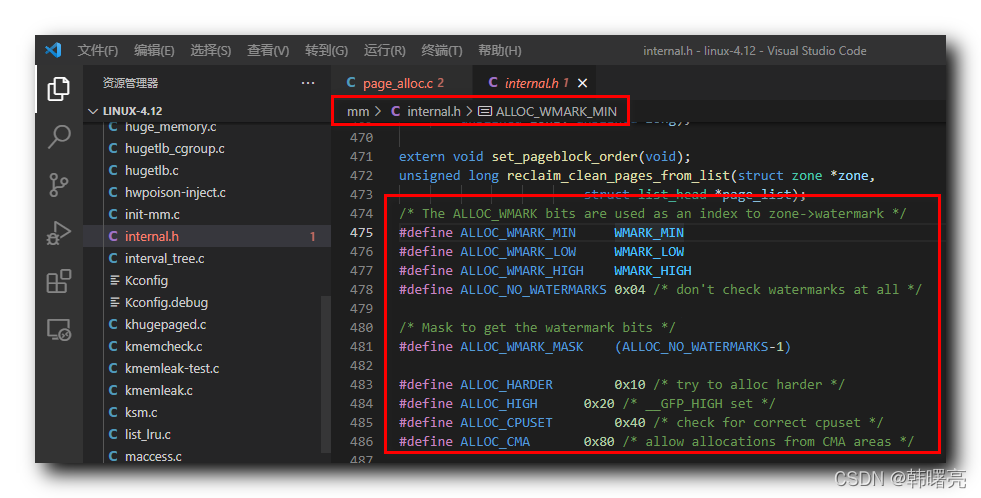

【Linux 内核 内存管理】物理分配页 ③ ( 物理页分配标志位分析 | ALLOC_WMARK_MIN | ALLOC_WMARK_MASK | ALLOC_HARDER )

#### 文章目录

-   [一、物理页分配标志位分析](https://cloud.tencent.com/developer?from_column=20421&from=20421)
-   -   [1、水线相关标志位 ( ALLOC\_WMARK\_MIN | ALLOC\_WMARK\_LOW | ALLOC\_WMARK\_HIGH | ALLOC\_NO\_WATERMARKS )](https://cloud.tencent.com/developer?from_column=20421&from=20421)
    -   [2、水线位源码 ( ALLOC\_WMARK\_MASK )](https://cloud.tencent.com/developer?from_column=20421&from=20421)
    -   [3、物理页分配标志位 ( ALLOC\_HARDER | ALLOC\_HIGH | ALLOC\_CPUSET | ALLOC\_CMA )](https://cloud.tencent.com/developer?from_column=20421&from=20421)
-   [二、物理页分配相关标志位完整源码](https://cloud.tencent.com/developer?from_column=20421&from=20421)

## 一、物理页分配标志位分析

* * *

使用 水线位 分配内存 , 相关源码定义在 Linux 内核源码的 linux-4.12\\mm\\internal.h#475 位置 ;

### 1、水线相关标志位 ( ALLOC\_WMARK\_MIN | ALLOC\_WMARK\_LOW | ALLOC\_WMARK\_HIGH | ALLOC\_NO\_WATERMARKS )

`ALLOC_WMARK_MIN` 宏定义 , 表示使用 " 最低水线 " 分配内存 ;

`ALLOC_WMARK_LOW` 宏定义 , 表示使用 " 低水线 " 分配内存 ;

`ALLOC_WMARK_HIGH` 宏定义 , 表示使用 " 高水线 " 分配内存 ;

`ALLOC_NO_WATERMARKS` 宏定义 , 表示使用 分配内存 时 , 不检查水位线 ;

代码语言：javascript

复制

    /* The ALLOC_WMARK bits are used as an index to zone->watermark */
    #define ALLOC_WMARK_MIN		WMARK_MIN
    #define ALLOC_WMARK_LOW		WMARK_LOW
    #define ALLOC_WMARK_HIGH	WMARK_HIGH
    #define ALLOC_NO_WATERMARKS	0x04 /* don't check watermarks at all */

**源码路径 :** linux-4.12\\mm\\internal.h#475

### 2、水线位源码 ( ALLOC\_WMARK\_MASK )

`ALLOC_WMARK_MASK` 宏定义 , 表示 获取 " 水线位 " 的 掩码 ;

代码语言：javascript

复制

    /* Mask to get the watermark bits */
    #define ALLOC_WMARK_MASK	(ALLOC_NO_WATERMARKS-1)

**源码路径 :** linux-4.12\\mm\\internal.h#481

### 3、物理页分配标志位 ( ALLOC\_HARDER | ALLOC\_HIGH | ALLOC\_CPUSET | ALLOC\_CMA )

`ALLOC_HARDER` 宏定义 , 表示 试图更努力的分配内存 ;

`ALLOC_HIGH` 宏定义 , 表示 设置调用者 `__GFP_HIGH` 高优先级 ;

`ALLOC_CPUSET` 宏定义 , 表示 检查 cpuset , 是否允许分配内存页 ;

`ALLOC_CMA` 宏定义 , 表示 允许 CMA 连续内存分配器 迁移类型 分配内存 ;

代码语言：javascript

复制

    #define ALLOC_HARDER		0x10 /* try to alloc harder */
    #define ALLOC_HIGH		0x20 /* __GFP_HIGH set */
    #define ALLOC_CPUSET		0x40 /* check for correct cpuset */
    #define ALLOC_CMA		0x80 /* allow allocations from CMA areas */

**源码路径 :** linux-4.12\\mm\\internal.h#483

## 二、物理页分配相关标志位完整源码

* * *

**源码如下 :**

代码语言：javascript

复制

    /* The ALLOC_WMARK bits are used as an index to zone->watermark */
    #define ALLOC_WMARK_MIN		WMARK_MIN
    #define ALLOC_WMARK_LOW		WMARK_LOW
    #define ALLOC_WMARK_HIGH	WMARK_HIGH
    #define ALLOC_NO_WATERMARKS	0x04 /* don't check watermarks at all */
    
    /* Mask to get the watermark bits */
    #define ALLOC_WMARK_MASK	(ALLOC_NO_WATERMARKS-1)
    
    #define ALLOC_HARDER		0x10 /* try to alloc harder */
    #define ALLOC_HIGH		0x20 /* __GFP_HIGH set */
    #define ALLOC_CPUSET		0x40 /* check for correct cpuset */
    #define ALLOC_CMA		0x80 /* allow allocations from CMA areas */

**源码路径 :** linux-4.12\\mm\\internal.h#475

## 参考

[【Linux 内核 内存管理】物理分配页 ③ ( 物理页分配标志位分析 | ALLOC_WMARK_MIN | ALLOC_WMARK_MASK | ALLOC_HARDER )-腾讯云开发者社区-腾讯云 (tencent.com)](https://cloud.tencent.com/developer/article/2253552)