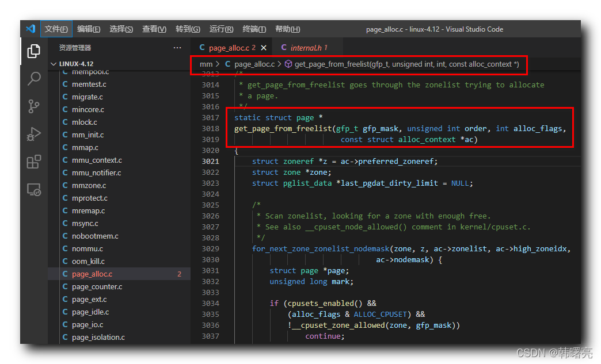

Linux 内核 内存管理】物理分配页 ④ ( __alloc_pages_nodemask 函数源码分析 | 快速路径 | 慢速路径 | get_page_from_freelist 源码 )

#### 文章目录

-   [一、\_\_alloc\_pages\_nodemask 函数源码分析 ( 快速路径 | 慢速路径 )](https://cloud.tencent.com/developer?from_column=20421&from=20421)
-   [二、get\_page\_from\_freelist 快速路径 调用函数 完整源码](https://cloud.tencent.com/developer?from_column=20421&from=20421)

在 [【Linux 内核 内存管理】物理分配页 ② ( \_\_alloc\_pages\_nodemask 函数参数分析 | \_\_alloc\_pages\_nodemask 函数分配物理页流程 )](https://cloud.tencent.com/developer/article/2253551?from_column=20421&from=20421) 博客中 , 分析了 `__alloc_pages_nodemask` 函数分配物理页流程如下 :

**首先** , 根据 `gfp_t gfp_mask` 分配标志位 参数 , 得到 " 内存节点 “ 的 首选 ” 区域类型 " 和 " 迁移类型 " ;

**然后** , 执行 " 快速路径 " , 第一次分配 尝试使用 低水线分配 ;

如果上述 " 快速路径 " 分配失败 , 则执行 " 慢速路径 " 分配 ;

上述涉及到了 " 快速路径 " 和 " 慢速路径 "

22

种物理页分配方式 ;

## 一、\_\_alloc\_pages\_nodemask 函数源码分析 ( 快速路径 | 慢速路径 )

* * *

在 `__alloc_pages_nodemask` 函数中 , 先调用 `get_page_from_freelist` 函数 , 尝试使用 " 快速路径 " 分配内存 , 如果内存分配失败 , 再跳转到 `out` 处 , 使用 " 慢速路径 " 分配内存 ;

代码语言：javascript

复制

    	/* First allocation attempt */
    	page = get_page_from_freelist(alloc_mask, order, alloc_flags, &ac);
    	if (likely(page))
    		goto out;

**源码路径 :** linux-4.12\\mm\\page\_alloc.c#4019

`out` 标号的代码如下 , 下面是 " 慢速路径 " 分配内存的源码 ;

代码语言：javascript

复制

    out:
    	if (memcg_kmem_enabled() && (gfp_mask & __GFP_ACCOUNT) && page &&
    	    unlikely(memcg_kmem_charge(page, gfp_mask, order) != 0)) {
    		__free_pages(page, order);
    		page = NULL;
    	}
    
    	if (kmemcheck_enabled && page)
    		kmemcheck_pagealloc_alloc(page, order, gfp_mask);
    
    	trace_mm_page_alloc(page, order, alloc_mask, ac.migratetype);
    
    	return page;

**源码路径 :** linux-4.12\\mm\\page\_alloc.c#4041

`__alloc_pages_nodemask` 函数完整源码参考 [【Linux 内核 内存管理】物理分配页 ① ( 分区伙伴分配器物理分配页核心函数 \_\_alloc\_pages\_nodemask | \_\_alloc\_pages\_nodemask 函数完整源码 )](https://cloud.tencent.com/developer/article/2253549?from_column=20421&from=20421) 博客 ;

## 二、get\_page\_from\_freelist 快速路径 调用函数 完整源码

* * *

快速路径 调用函数 `get_page_from_freelist` 函数定义在 Linux 内核源码的 linux-4.12\\mm\\page\_alloc.c#3017 位置 ;

代码语言：javascript

复制

    /*
     * get_page_from_freelist goes through the zonelist trying to allocate
     * a page.
     */
    static struct page *
    get_page_from_freelist(gfp_t gfp_mask, unsigned int order, int alloc_flags,
    						const struct alloc_context *ac)
    {
    	struct zoneref *z = ac->preferred_zoneref;
    	struct zone *zone;
    	struct pglist_data *last_pgdat_dirty_limit = NULL;
    
    	/*
    	 * Scan zonelist, looking for a zone with enough free.
    	 * See also __cpuset_node_allowed() comment in kernel/cpuset.c.
    	 */
    	for_next_zone_zonelist_nodemask(zone, z, ac->zonelist, ac->high_zoneidx,
    								ac->nodemask) {
    		struct page *page;
    		unsigned long mark;
    
    		if (cpusets_enabled() &&
    			(alloc_flags & ALLOC_CPUSET) &&
    			!__cpuset_zone_allowed(zone, gfp_mask))
    				continue;
    		/*
    		 * When allocating a page cache page for writing, we
    		 * want to get it from a node that is within its dirty
    		 * limit, such that no single node holds more than its
    		 * proportional share of globally allowed dirty pages.
    		 * The dirty limits take into account the node's
    		 * lowmem reserves and high watermark so that kswapd
    		 * should be able to balance it without having to
    		 * write pages from its LRU list.
    		 *
    		 * XXX: For now, allow allocations to potentially
    		 * exceed the per-node dirty limit in the slowpath
    		 * (spread_dirty_pages unset) before going into reclaim,
    		 * which is important when on a NUMA setup the allowed
    		 * nodes are together not big enough to reach the
    		 * global limit.  The proper fix for these situations
    		 * will require awareness of nodes in the
    		 * dirty-throttling and the flusher threads.
    		 */
    		if (ac->spread_dirty_pages) {
    			if (last_pgdat_dirty_limit == zone->zone_pgdat)
    				continue;
    
    			if (!node_dirty_ok(zone->zone_pgdat)) {
    				last_pgdat_dirty_limit = zone->zone_pgdat;
    				continue;
    			}
    		}
    
    		mark = zone->watermark[alloc_flags & ALLOC_WMARK_MASK];
    		if (!zone_watermark_fast(zone, order, mark,
    				       ac_classzone_idx(ac), alloc_flags)) {
    			int ret;
    
    			/* Checked here to keep the fast path fast */
    			BUILD_BUG_ON(ALLOC_NO_WATERMARKS < NR_WMARK);
    			if (alloc_flags & ALLOC_NO_WATERMARKS)
    				goto try_this_zone;
    
    			if (node_reclaim_mode == 0 ||
    			    !zone_allows_reclaim(ac->preferred_zoneref->zone, zone))
    				continue;
    
    			ret = node_reclaim(zone->zone_pgdat, gfp_mask, order);
    			switch (ret) {
    			case NODE_RECLAIM_NOSCAN:
    				/* did not scan */
    				continue;
    			case NODE_RECLAIM_FULL:
    				/* scanned but unreclaimable */
    				continue;
    			default:
    				/* did we reclaim enough */
    				if (zone_watermark_ok(zone, order, mark,
    						ac_classzone_idx(ac), alloc_flags))
    					goto try_this_zone;
    
    				continue;
    			}
    		}
    
    try_this_zone:
    		page = rmqueue(ac->preferred_zoneref->zone, zone, order,
    				gfp_mask, alloc_flags, ac->migratetype);
    		if (page) {
    			prep_new_page(page, order, gfp_mask, alloc_flags);
    
    			/*
    			 * If this is a high-order atomic allocation then check
    			 * if the pageblock should be reserved for the future
    			 */
    			if (unlikely(order && (alloc_flags & ALLOC_HARDER)))
    				reserve_highatomic_pageblock(page, zone, order);
    
    			return page;
    		}
    	}
    
    	return NULL;
    }

**源码路径 :** linux-4.12\\mm\\page\_alloc.c#3017

## 参考

[【Linux 内核 内存管理】物理分配页 ④ ( __alloc_pages_nodemask 函数源码分析 | 快速路径 | 慢速路径 | get_page_from_freelist 源码 )-腾讯云开发者社区-腾讯云 (tencent.com)](https://cloud.tencent.com/developer/article/2253553)