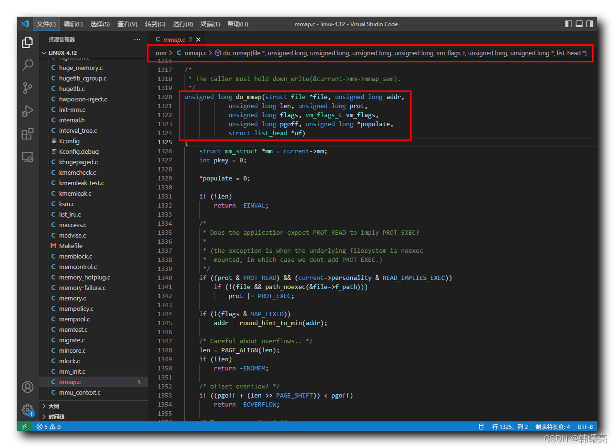

【Linux 内核 内存管理】mmap 系统调用源码分析 ④ ( do_mmap 函数执行流程 | do_mmap 函数源码 )

#### 文章目录

-   [一、do\_mmap 函数执行流程](https://cloud.tencent.com/developer?from_column=20421&from=20421)
-   [二、do\_mmap 函数源码](https://cloud.tencent.com/developer?from_column=20421&from=20421)

调用 `mmap` 系统调用 , 先检查 " 偏移 " 是否是 " 内存页大小 " 的 " 整数倍 " , 如果偏移是内存页大小的整数倍 , 则调用 `sys_mmap_pgoff` 函数 , 继续向下执行 ;

在 `sys_mmap_pgoff` 系统调用函数 中 , 最后调用了 `vm_mmap_pgoff` 函数 , 继续向下执行 ;

在 `vm_mmap_pgoff` 函数 中 , 核心处理过程就是调用 `do_mmap` 函数 , 这是 " 内存映射 " 创建的主要函数逻辑 ;

## 一、do\_mmap 函数执行流程

* * *

`do_mmap` 函数 , 主要功能是 创建 " 内存映射 " ;

**首先** , 执行 `get_unmapped_area` 函数 , 获取未被映射的内存区域 , 根据不同的情况 , 如 " 文件映射 " 还是 " 匿名映射 " , 调用对应的 " 分配虚拟地址区间 " 的函数 ;

代码语言：javascript

复制

    	/* Obtain the address to map to. we verify (or select) it and ensure
    	 * that it represents a valid section of the address space.
    	 */
    	addr = get_unmapped_area(file, addr, len, pgoff, flags);

**然后** , 计算 " 虚拟内存标志 " ;

**最后** , 通过调用 `mmap_region` 函数 , 创建 " 虚拟内存区域 " ;

代码语言：javascript

复制

    addr = mmap_region(file, addr, len, vm_flags, pgoff, uf);

## 二、do\_mmap 函数源码

* * *

创建 " 内存映射 " 主要是 `do_mmap` 函数实现的 , 该函数定义在 Linux 内核源码的 linux-4.12\\mm\\mmap.c#1320 位置 ;

**`do_mmap` 函数源码如下 :**

代码语言：javascript

复制

    /*
     * The caller must hold down_write(¤t->mm->mmap_sem).
     */
    unsigned long do_mmap(struct file *file, unsigned long addr,
    			unsigned long len, unsigned long prot,
    			unsigned long flags, vm_flags_t vm_flags,
    			unsigned long pgoff, unsigned long *populate,
    			struct list_head *uf)
    {
    	struct mm_struct *mm = current->mm;
    	int pkey = 0;
    
    	*populate = 0;
    
    	if (!len)
    		return -EINVAL;
    
    	/*
    	 * Does the application expect PROT_READ to imply PROT_EXEC?
    	 *
    	 * (the exception is when the underlying filesystem is noexec
    	 *  mounted, in which case we dont add PROT_EXEC.)
    	 */
    	if ((prot & PROT_READ) && (current->personality & READ_IMPLIES_EXEC))
    		if (!(file && path_noexec(&file->f_path)))
    			prot |= PROT_EXEC;
    
    	if (!(flags & MAP_FIXED))
    		addr = round_hint_to_min(addr);
    
    	/* Careful about overflows.. */
    	len = PAGE_ALIGN(len);
    	if (!len)
    		return -ENOMEM;
    
    	/* offset overflow? */
    	if ((pgoff + (len >> PAGE_SHIFT)) < pgoff)
    		return -EOVERFLOW;
    
    	/* Too many mappings? */
    	if (mm->map_count > sysctl_max_map_count)
    		return -ENOMEM;
    
    	/* Obtain the address to map to. we verify (or select) it and ensure
    	 * that it represents a valid section of the address space.
    	 */
    	addr = get_unmapped_area(file, addr, len, pgoff, flags);
    	if (offset_in_page(addr))
    		return addr;
    
    	if (prot == PROT_EXEC) {
    		pkey = execute_only_pkey(mm);
    		if (pkey < 0)
    			pkey = 0;
    	}
    
    	/* Do simple checking here so the lower-level routines won't have
    	 * to. we assume access permissions have been handled by the open
    	 * of the memory object, so we don't do any here.
    	 */
    	vm_flags |= calc_vm_prot_bits(prot, pkey) | calc_vm_flag_bits(flags) |
    			mm->def_flags | VM_MAYREAD | VM_MAYWRITE | VM_MAYEXEC;
    
    	if (flags & MAP_LOCKED)
    		if (!can_do_mlock())
    			return -EPERM;
    
    	if (mlock_future_check(mm, vm_flags, len))
    		return -EAGAIN;
    
    	if (file) {
    		struct inode *inode = file_inode(file);
    
    		switch (flags & MAP_TYPE) {
    		case MAP_SHARED:
    			if ((prot&PROT_WRITE) && !(file->f_mode&FMODE_WRITE))
    				return -EACCES;
    
    			/*
    			 * Make sure we don't allow writing to an append-only
    			 * file..
    			 */
    			if (IS_APPEND(inode) && (file->f_mode & FMODE_WRITE))
    				return -EACCES;
    
    			/*
    			 * Make sure there are no mandatory locks on the file.
    			 */
    			if (locks_verify_locked(file))
    				return -EAGAIN;
    
    			vm_flags |= VM_SHARED | VM_MAYSHARE;
    			if (!(file->f_mode & FMODE_WRITE))
    				vm_flags &= ~(VM_MAYWRITE | VM_SHARED);
    
    			/* fall through */
    		case MAP_PRIVATE:
    			if (!(file->f_mode & FMODE_READ))
    				return -EACCES;
    			if (path_noexec(&file->f_path)) {
    				if (vm_flags & VM_EXEC)
    					return -EPERM;
    				vm_flags &= ~VM_MAYEXEC;
    			}
    
    			if (!file->f_op->mmap)
    				return -ENODEV;
    			if (vm_flags & (VM_GROWSDOWN|VM_GROWSUP))
    				return -EINVAL;
    			break;
    
    		default:
    			return -EINVAL;
    		}
    	} else {
    		switch (flags & MAP_TYPE) {
    		case MAP_SHARED:
    			if (vm_flags & (VM_GROWSDOWN|VM_GROWSUP))
    				return -EINVAL;
    			/*
    			 * Ignore pgoff.
    			 */
    			pgoff = 0;
    			vm_flags |= VM_SHARED | VM_MAYSHARE;
    			break;
    		case MAP_PRIVATE:
    			/*
    			 * Set pgoff according to addr for anon_vma.
    			 */
    			pgoff = addr >> PAGE_SHIFT;
    			break;
    		default:
    			return -EINVAL;
    		}
    	}
    
    	/*
    	 * Set 'VM_NORESERVE' if we should not account for the
    	 * memory use of this mapping.
    	 */
    	if (flags & MAP_NORESERVE) {
    		/* We honor MAP_NORESERVE if allowed to overcommit */
    		if (sysctl_overcommit_memory != OVERCOMMIT_NEVER)
    			vm_flags |= VM_NORESERVE;
    
    		/* hugetlb applies strict overcommit unless MAP_NORESERVE */
    		if (file && is_file_hugepages(file))
    			vm_flags |= VM_NORESERVE;
    	}
    
    	addr = mmap_region(file, addr, len, vm_flags, pgoff, uf);
    	if (!IS_ERR_VALUE(addr) &&
    	    ((vm_flags & VM_LOCKED) ||
    	     (flags & (MAP_POPULATE | MAP_NONBLOCK)) == MAP_POPULATE))
    		*populate = len;
    	return addr;
    }

**源码路径 :** linux-4.12\\mm\\mmap.c#1320

## 参考

[【Linux 内核 内存管理】mmap 系统调用源码分析 ④ ( do_mmap 函数执行流程 | do_mmap 函数源码 )-腾讯云开发者社区-腾讯云 (tencent.com)](https://cloud.tencent.com/developer/article/2253492)