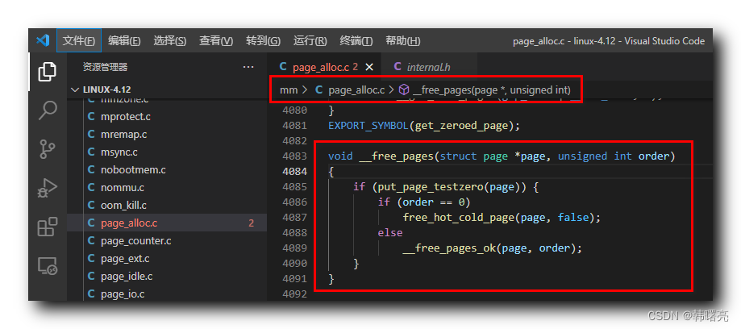

【Linux 内核 内存管理】物理页释放 ( 物理页释放 __free_pages 函数 )

#### 文章目录

-   [一、物理页释放 \_\_free\_pages 函数](https://cloud.tencent.com/developer?from_column=20421&from=20421)

## 一、物理页释放 \_\_free\_pages 函数

* * *

页分配器 提供了 释放 物理页的 函数 `__free_pages` , 该函数定义在 Linux 内核源码的 linux-4.12\\mm\\page\_alloc.c#4083 位置 ;

**`__free_pages` 函数参数分析 :**

`struct page *page` 参数 表示 要释放的 物理页 `page` 的 [虚拟空间](https://cloud.tencent.com/product/lighthouse?from_column=20065&from=20065)地址 ;

`unsigned int order` 参数 表示 要释放的 物理页 的 " 阶数 " , 也就是 要释放的物理页大小 ;

> **阶 ( Order ) :** 物理页 的 数量单位 ,

nn

阶页块 指的是

2n2^n

个 连续的 " 物理页 " ; 参考 [【Linux 内核 内存管理】伙伴分配器 ① ( 伙伴分配器引入 | 页块、阶 | 伙伴 )](https://cloud.tencent.com/developer/tools/blog-entry?target=https%3A%2F%2Fblog.csdn.net%2Fshulianghan%2Farticle%2Fdetails%2F124304776&source=article&objectId=2253561)

**`__free_pages` 函数源码 :**

代码语言：javascript

复制

    void __free_pages(struct page *page, unsigned int order)
    {
    	if (put_page_testzero(page)) {
    		if (order == 0)
    			free_hot_cold_page(page, false);
    		else
    			__free_pages_ok(page, order);
    	}
    }

**源码路径 :** linux-4.12\\mm\\page\_alloc.c#4083

## 参考

[【Linux 内核 内存管理】物理页释放 ( 物理页释放 __free_pages 函数 )-腾讯云开发者社区-腾讯云 (tencent.com)](https://cloud.tencent.com/developer/article/2253561)