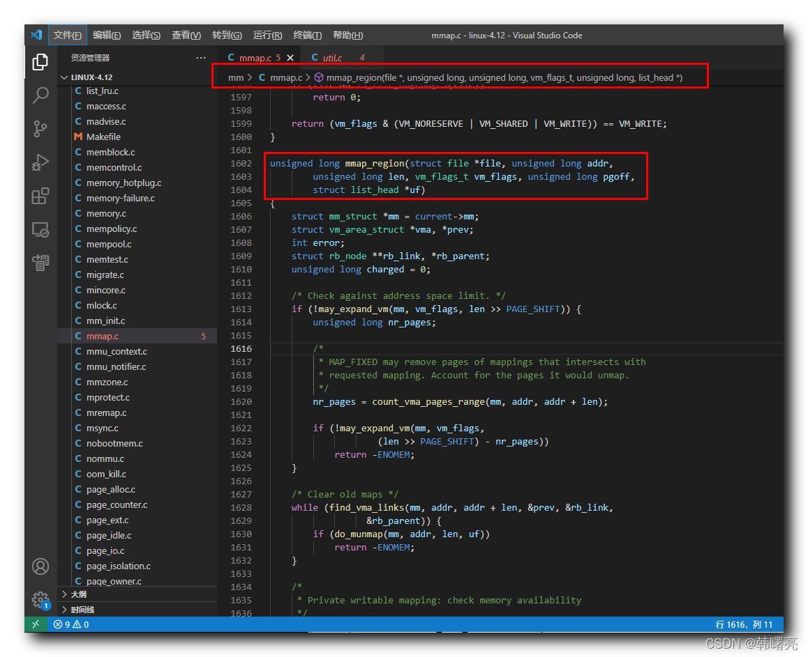

【Linux 内核 内存管理】mmap 系统调用源码分析 ⑤ ( mmap_region 函数执行流程 | mmap_region 函数源码 )

#### 文章目录

-   [一、mmap\_region 函数执行流程](https://cloud.tencent.com/developer?from_column=20421&from=20421)
-   -   [1、检查内存申请是否合法](https://cloud.tencent.com/developer?from_column=20421&from=20421)
    -   [2、创建 " 虚拟内存区域 "](https://cloud.tencent.com/developer?from_column=20421&from=20421)
-   [二、mmap\_region 函数源码](https://cloud.tencent.com/developer?from_column=20421&from=20421)

调用 `mmap` 系统调用 , 先检查 " 偏移 " 是否是 " 内存页大小 " 的 " 整数倍 " , 如果偏移是内存页大小的整数倍 , 则调用 `sys_mmap_pgoff` 函数 , 继续向下执行 ;

在 `sys_mmap_pgoff` 系统调用函数 中 , 最后调用了 `vm_mmap_pgoff` 函数 , 继续向下执行 ;

在 `vm_mmap_pgoff` 函数 中 , 核心处理过程就是调用 `do_mmap` 函数 , 这是 " 内存映射 " 创建的主要函数逻辑 ;

在 `do_mmap` 函数中 , 调用了 `mmap_region` 函数 , 创建 " 虚拟内存区域 " ;

## 一、mmap\_region 函数执行流程

* * *

### 1、检查内存申请是否合法

在 `mmap_region` 函数中 ,

**首先** , 调用 `may_expand_vm` 函数 , 针对 进程 的 " 用户虚拟地址空间 " 地址进行检查 , 查看是否超出了地址区间限制 ;

代码语言：javascript

复制

    	/* Check against address space limit. */
    	if (!may_expand_vm(mm, vm_flags, len >> PAGE_SHIFT)) {
    		unsigned long nr_pages;
    
    		/*
    		 * MAP_FIXED may remove pages of mappings that intersects with
    		 * requested mapping. Account for the pages it would unmap.
    		 */
    		nr_pages = count_vma_pages_range(mm, addr, addr + len);
    
    		if (!may_expand_vm(mm, vm_flags,
    					(len >> PAGE_SHIFT) - nr_pages))
    			return -ENOMEM;
    	}

**源码路径 :** linux-4.12\\mm\\mmap.c#1612

**然后** , 检查 申请的 内存空间 , 是否与旧的 虚拟内存空间 有 重叠 , 如果有重叠部分 , 则调用 `do_munmap` 函数 , 删除内存空间 ;

代码语言：javascript

复制

    	/* Clear old maps */
    	while (find_vma_links(mm, addr, addr + len, &prev, &rb_link,
    			      &rb_parent)) {
    		if (do_munmap(mm, addr, len, uf))
    			return -ENOMEM;
    	}

**源码路径 :** linux-4.12\\mm\\mmap.c#1627

**再后** , 检查是否有 私有的写映射 , 即检查内存是否可用 ;

代码语言：javascript

复制

    	/*
    	 * Private writable mapping: check memory availability
    	 */
    	if (accountable_mapping(file, vm_flags)) {
    		charged = len >> PAGE_SHIFT;
    		if (security_vm_enough_memory_mm(mm, charged))
    			return -ENOMEM;
    		vm_flags |= VM_ACCOUNT;
    	}

**源码路径 :** linux-4.12\\mm\\mmap.c#1637

**最后** , 检查是否可以与已有的 " 虚拟内存区域 " 进行合并 , 避免内存空间浪费 ;

代码语言：javascript

复制

    	/*
    	 * Can we just expand an old mapping?
    	 */
    	vma = vma_merge(mm, prev, addr, addr + len, vm_flags,
    			NULL, file, pgoff, NULL, NULL_VM_UFFD_CTX);
    	if (vma)
    		goto out;

**源码路径 :** linux-4.12\\mm\\mmap.c#1647

检查完毕后 , 开始 创建 " 虚拟内存区域 " ;

### 2、创建 " 虚拟内存区域 "

**首先** , 检查是否可以与已有的 " 虚拟内存区域 " 进行合并 , 避免内存空间浪费 ;

-   如果可以合并 , 则调用 `vma_merge` 空间进行内存合并 ;
-   如果不可以合并 , 则创建新的虚拟内存区域 , 即跳转到 `out` 位置进行执行 ;
    -   如果是 文件映射 , 调用 `call_mmap` 函数 , 创建内存区域 ;
    -   如果是 匿名映射 , 调用 `shmem_zero_setup` 函数 , 创建内存区域 ;

代码语言：javascript

复制

    	/*
    	 * Can we just expand an old mapping?
    	 */
    	vma = vma_merge(mm, prev, addr, addr + len, vm_flags,
    			NULL, file, pgoff, NULL, NULL_VM_UFFD_CTX);
    	if (vma)
    		goto out;

**源码路径 :** linux-4.12\\mm\\mmap.c#1647

在创建 " 虚拟内存区域 " 时 ,

-   如果命中 `file` 分支 , 则是 创建 " 文件映射 " 内存区域 , 核心是调用 调用 `call_mmap` 函数 ;
-   如果命中 `else` 分支 , 就是创建 " 匿名映射 " 内存区域 , 核心是 调用 `shmem_zero_setup` 函数 ;

代码语言：javascript

复制

    	if (file) {
    		if (vm_flags & VM_DENYWRITE) {
    			error = deny_write_access(file);
    			if (error)
    				goto free_vma;
    		}
    		if (vm_flags & VM_SHARED) {
    			error = mapping_map_writable(file->f_mapping);
    			if (error)
    				goto allow_write_and_free_vma;
    		}
    
    		/* ->mmap() can change vma->vm_file, but must guarantee that
    		 * vma_link() below can deny write-access if VM_DENYWRITE is set
    		 * and map writably if VM_SHARED is set. This usually means the
    		 * new file must not have been exposed to user-space, yet.
    		 */
    		vma->vm_file = get_file(file);
    		error = call_mmap(file, vma);
    		if (error)
    			goto unmap_and_free_vma;
    
    		/* Can addr have changed??
    		 *
    		 * Answer: Yes, several device drivers can do it in their
    		 *         f_op->mmap method. -DaveM
    		 * Bug: If addr is changed, prev, rb_link, rb_parent should
    		 *      be updated for vma_link()
    		 */
    		WARN_ON_ONCE(addr != vma->vm_start);
    
    		addr = vma->vm_start;
    		vm_flags = vma->vm_flags;
    	} else if (vm_flags & VM_SHARED) {
    		error = shmem_zero_setup(vma);
    		if (error)
    			goto free_vma;
    	}

**源码路径 :** linux-4.12\\mm\\mmap.c#1671

在后 , 调用 `vma_link` 函数 和 `vma_set_page_prot` 函数 , 完成 " 虚拟内存区域 " 创建 ;

代码语言：javascript

复制

    	vma_link(mm, vma, prev, rb_link, rb_parent);

**源码路径 :** linux-4.12\\mm\\mmap.c#1710

代码语言：javascript

复制

    	vma_set_page_prot(vma);

**源码路径 :** linux-4.12\\mm\\mmap.c#1743

## 二、mmap\_region 函数源码

* * *

`mmap_region` 函数源码 定义在 Linux 内核源码的 linux-4.12\\mm\\mmap.c#1602 位置 ;

**`mmap_region` 函数源码如下 :**

代码语言：javascript

复制

    unsigned long mmap_region(struct file *file, unsigned long addr,
    		unsigned long len, vm_flags_t vm_flags, unsigned long pgoff,
    		struct list_head *uf)
    {
    	struct mm_struct *mm = current->mm;
    	struct vm_area_struct *vma, *prev;
    	int error;
    	struct rb_node **rb_link, *rb_parent;
    	unsigned long charged = 0;
    
    	/* Check against address space limit. */
    	if (!may_expand_vm(mm, vm_flags, len >> PAGE_SHIFT)) {
    		unsigned long nr_pages;
    
    		/*
    		 * MAP_FIXED may remove pages of mappings that intersects with
    		 * requested mapping. Account for the pages it would unmap.
    		 */
    		nr_pages = count_vma_pages_range(mm, addr, addr + len);
    
    		if (!may_expand_vm(mm, vm_flags,
    					(len >> PAGE_SHIFT) - nr_pages))
    			return -ENOMEM;
    	}
    
    	/* Clear old maps */
    	while (find_vma_links(mm, addr, addr + len, &prev, &rb_link,
    			      &rb_parent)) {
    		if (do_munmap(mm, addr, len, uf))
    			return -ENOMEM;
    	}
    
    	/*
    	 * Private writable mapping: check memory availability
    	 */
    	if (accountable_mapping(file, vm_flags)) {
    		charged = len >> PAGE_SHIFT;
    		if (security_vm_enough_memory_mm(mm, charged))
    			return -ENOMEM;
    		vm_flags |= VM_ACCOUNT;
    	}
    
    	/*
    	 * Can we just expand an old mapping?
    	 */
    	vma = vma_merge(mm, prev, addr, addr + len, vm_flags,
    			NULL, file, pgoff, NULL, NULL_VM_UFFD_CTX);
    	if (vma)
    		goto out;
    
    	/*
    	 * Determine the object being mapped and call the appropriate
    	 * specific mapper. the address has already been validated, but
    	 * not unmapped, but the maps are removed from the list.
    	 */
    	vma = kmem_cache_zalloc(vm_area_cachep, GFP_KERNEL);
    	if (!vma) {
    		error = -ENOMEM;
    		goto unacct_error;
    	}
    
    	vma->vm_mm = mm;
    	vma->vm_start = addr;
    	vma->vm_end = addr + len;
    	vma->vm_flags = vm_flags;
    	vma->vm_page_prot = vm_get_page_prot(vm_flags);
    	vma->vm_pgoff = pgoff;
    	INIT_LIST_HEAD(&vma->anon_vma_chain);
    
    	if (file) {
    		if (vm_flags & VM_DENYWRITE) {
    			error = deny_write_access(file);
    			if (error)
    				goto free_vma;
    		}
    		if (vm_flags & VM_SHARED) {
    			error = mapping_map_writable(file->f_mapping);
    			if (error)
    				goto allow_write_and_free_vma;
    		}
    
    		/* ->mmap() can change vma->vm_file, but must guarantee that
    		 * vma_link() below can deny write-access if VM_DENYWRITE is set
    		 * and map writably if VM_SHARED is set. This usually means the
    		 * new file must not have been exposed to user-space, yet.
    		 */
    		vma->vm_file = get_file(file);
    		error = call_mmap(file, vma);
    		if (error)
    			goto unmap_and_free_vma;
    
    		/* Can addr have changed??
    		 *
    		 * Answer: Yes, several device drivers can do it in their
    		 *         f_op->mmap method. -DaveM
    		 * Bug: If addr is changed, prev, rb_link, rb_parent should
    		 *      be updated for vma_link()
    		 */
    		WARN_ON_ONCE(addr != vma->vm_start);
    
    		addr = vma->vm_start;
    		vm_flags = vma->vm_flags;
    	} else if (vm_flags & VM_SHARED) {
    		error = shmem_zero_setup(vma);
    		if (error)
    			goto free_vma;
    	}
    
    	vma_link(mm, vma, prev, rb_link, rb_parent);
    	/* Once vma denies write, undo our temporary denial count */
    	if (file) {
    		if (vm_flags & VM_SHARED)
    			mapping_unmap_writable(file->f_mapping);
    		if (vm_flags & VM_DENYWRITE)
    			allow_write_access(file);
    	}
    	file = vma->vm_file;
    out:
    	perf_event_mmap(vma);
    
    	vm_stat_account(mm, vm_flags, len >> PAGE_SHIFT);
    	if (vm_flags & VM_LOCKED) {
    		if (!((vm_flags & VM_SPECIAL) || is_vm_hugetlb_page(vma) ||
    					vma == get_gate_vma(current->mm)))
    			mm->locked_vm += (len >> PAGE_SHIFT);
    		else
    			vma->vm_flags &= VM_LOCKED_CLEAR_MASK;
    	}
    
    	if (file)
    		uprobe_mmap(vma);
    
    	/*
    	 * New (or expanded) vma always get soft dirty status.
    	 * Otherwise user-space soft-dirty page tracker won't
    	 * be able to distinguish situation when vma area unmapped,
    	 * then new mapped in-place (which must be aimed as
    	 * a completely new data area).
    	 */
    	vma->vm_flags |= VM_SOFTDIRTY;
    
    	vma_set_page_prot(vma);
    
    	return addr;
    
    unmap_and_free_vma:
    	vma->vm_file = NULL;
    	fput(file);
    
    	/* Undo any partial mapping done by a device driver. */
    	unmap_region(mm, vma, prev, vma->vm_start, vma->vm_end);
    	charged = 0;
    	if (vm_flags & VM_SHARED)
    		mapping_unmap_writable(file->f_mapping);
    allow_write_and_free_vma:
    	if (vm_flags & VM_DENYWRITE)
    		allow_write_access(file);
    free_vma:
    	kmem_cache_free(vm_area_cachep, vma);
    unacct_error:
    	if (charged)
    		vm_unacct_memory(charged);
    	return error;
    }

**源码路径 :** linux-4.12\\mm\\mmap.c#1602

## 参考

[【Linux 内核 内存管理】mmap 系统调用源码分析 ⑤ ( mmap_region 函数执行流程 | mmap_region 函数源码 )-腾讯云开发者社区-腾讯云 (tencent.com)](https://cloud.tencent.com/developer/article/2253493)