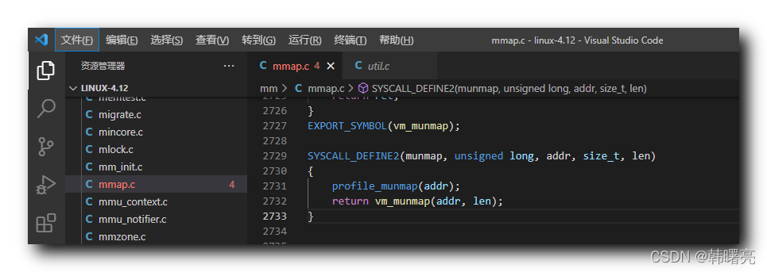

【Linux 内核 内存管理】munmap 系统调用源码分析 ① ( munmap 系统调用函数执行流程 | munmap 函数源码 | vm_munmap 函数源码 )

#### 文章目录

-   [一、munmap 系统调用函数执行流程](https://cloud.tencent.com/developer?from_column=20421&from=20421)
-   [二、munmap 系统调用函数源码](https://cloud.tencent.com/developer?from_column=20421&from=20421)
-   [三、vm\_munmap 函数源码](https://cloud.tencent.com/developer?from_column=20421&from=20421)

## 一、munmap 系统调用函数执行流程

* * *

`munmap` 系统调用函数 的作用是 " 删除内存映射 " , 该函数有

22

个参数 , 分别是 `unsigned long addr` 和 `size_t, len` , 前者是 内存映射 的 起始地址 , 后者是 内存映射 的 长度 ;

`munmap` 系统调用函数 调用了 `vm_munmap` 函数 , 在 `vm_munmap` 函数 中 , 又调用了 `do_munmap` 函数 ,

`do_munmap` 函数 是 删除 内存映射 的 核心函数 ;

## 二、munmap 系统调用函数源码

* * *

`munmap` 系统调用函数 , 定义在 Linux 内核源码 linux-4.12\\mm\\mmap.c#2729 位置 ;

**`munmap` 系统调用函数源码如下 :**

代码语言：javascript

复制

    SYSCALL_DEFINE2(munmap, unsigned long, addr, size_t, len)
    {
    	profile_munmap(addr);
    	return vm_munmap(addr, len);
    }

**源码路径 :** linux-4.12\\mm\\mmap.c#2729

在这里插入图片描述

## 三、vm\_munmap 函数源码

* * *

`vm_munmap` 函数 , 定义在 Linux 内核源码 linux-4.12\\mm\\mmap.c#2713 位置 ;

在 `vm_munmap` 函数 中 , 调用了 `do_munmap` 函数 ,

`do_munmap` 函数 是 删除 内存映射 的 核心函数 ;

**`vm_munmap` 函数源码如下 :**

代码语言：javascript

复制

    int vm_munmap(unsigned long start, size_t len)
    {
    	int ret;
    	struct mm_struct *mm = current->mm;
    	LIST_HEAD(uf);
    
    	if (down_write_killable(&mm->mmap_sem))
    		return -EINTR;
    
    	ret = do_munmap(mm, start, len, &uf);
    	up_write(&mm->mmap_sem);
    	userfaultfd_unmap_complete(mm, &uf);
    	return ret;
    }

**源码路径 :** linux-4.12\\mm\\mmap.c#2713

## 参考

[【Linux 内核 内存管理】munmap 系统调用源码分析 ① ( munmap 系统调用函数执行流程 | munmap 函数源码 | vm_munmap 函数源码 )-腾讯云开发者社区-腾讯云 (tencent.com)](https://cloud.tencent.com/developer/article/2253494)