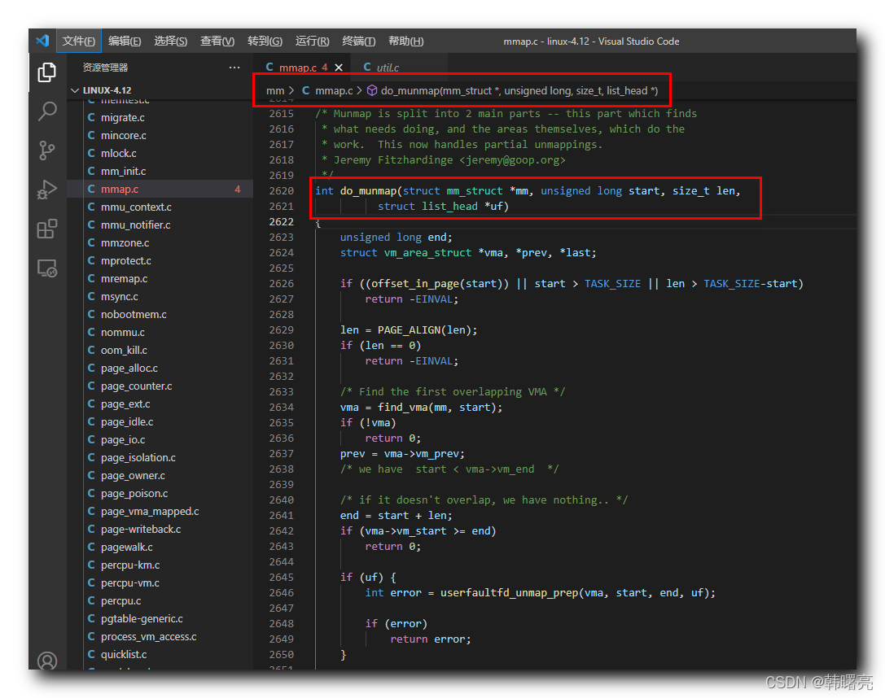

【Linux 内核 内存管理】munmap 系统调用源码分析 ② ( do_munmap 函数执行流程 | do_munmap 函数源码 )

#### 文章目录

-   [一、do\_munmap 函数执行流程](https://cloud.tencent.com/developer?from_column=20421&from=20421)
-   [二、do\_munmap 函数源码](https://cloud.tencent.com/developer?from_column=20421&from=20421)

`munmap` 系统调用函数 调用了 `vm_munmap` 函数 , 在 `vm_munmap` 函数 中 , 又调用了 `do_munmap` 函数 , `do_munmap` 函数 是 删除 内存映射 的 核心函数 ;

## 一、do\_munmap 函数执行流程

* * *

**do\_munmap 函数执行流程 :**

根据 `unsigned long start` 参数的起始地址 , 找到要删除的 第一个 虚拟内存区域 vm\_area\_struct 结构体实例 ,

代码语言：javascript

复制

    int do_munmap(struct mm_struct *mm, unsigned long start, size_t len,
    	      struct list_head *uf)
    	...
    	struct vm_area_struct *vma, *prev, *last;
    	...
    	/* Find the first overlapping VMA */
    	vma = find_vma(mm, start);
    	if (!vma)
    		return 0;
    	...
    }

如果不是删除整个 vam 内存区域 , 而只是删除部分内存 , 那么需要分裂 `vm_area_struct *vma` 指向的内存区域 ;

代码语言：javascript

复制

    		error = __split_vma(mm, vma, start, 0);

根据 `end` 结束地址 , 找到 需要删除的 虚拟内存区域 的 最后一个 `vm_area_struct *last` 实例 ;

代码语言：javascript

复制

    	/* Does it split the last one? */
    	last = find_vma(mm, end);

如果不是删除整个 vam 内存区域 , 而只是删除部分内存 , 那么需要分裂 `vm_area_struct *last` 指向的内存区域 ;

代码语言：javascript

复制

    	if (last && end > last->vm_start) {
    		int error = __split_vma(mm, last, end, 1);
    		if (error)
    			return error;
    	}

如果 被删除的 内存区域 被锁定在 内存中 , 即 不允许换出到交换区 , 则调用 `munlock_vma_pages_all` 函数 解除 内存锁定 ;

代码语言：javascript

复制

    	/*
    	 * unlock any mlock()ed ranges before detaching vmas
    	 */
    	if (mm->locked_vm) {
    		struct vm_area_struct *tmp = vma;
    		while (tmp && tmp->vm_start < end) {
    			if (tmp->vm_flags & VM_LOCKED) {
    				mm->locked_vm -= vma_pages(tmp);
    				munlock_vma_pages_all(tmp);
    			}
    			tmp = tmp->vm_next;
    		}
    	}

调用 `detach_vmas_to_be_unmapped` 函数 , 将要删除的 " 虚拟内存区域 " 从 进程的 虚拟内存区域 链表 和 红黑树 数据结构中删除 ,

这些内存区域 单独放在一个临时链表中 ;

代码语言：javascript

复制

    	/*
    	 * Remove the vma's, and unmap the actual pages
    	 */
    	detach_vmas_to_be_unmapped(mm, vma, prev, end);

调用 `unmap_region` 函数 , 将 进程 的 页表中 的 " 被删除内存区域 对应的 映射 " 删除 , 从 处理器 页表缓存 中 也 删除对应 映射 ;

代码语言：javascript

复制

    	unmap_region(mm, vma, prev, start, end);

调用 `arch_unmap` 函数 , 执行 该处理器架构 对应的 删除内存映射 的 处理操作 ;

代码语言：javascript

复制

    	arch_unmap(mm, vma, start, end);

调用 `remove_vma_list` 函数 , 删除所有的虚拟内存区域 ;

代码语言：javascript

复制

    	/* Fix up all other VM information */
    	remove_vma_list(mm, vma);

## 二、do\_munmap 函数源码

* * *

`do_munmap` 函数 , 定义在 Linux 内核源码 linux-4.12\\mm\\mmap.c#2620 位置 ;

**`do_munmap` 函数源码如下 :**

代码语言：javascript

复制

    /* Munmap is split into 2 main parts -- this part which finds
     * what needs doing, and the areas themselves, which do the
     * work.  This now handles partial unmappings.
     * Jeremy Fitzhardinge <jeremy@goop.org>
     */
    int do_munmap(struct mm_struct *mm, unsigned long start, size_t len,
    	      struct list_head *uf)
    {
    	unsigned long end;
    	struct vm_area_struct *vma, *prev, *last;
    
    	if ((offset_in_page(start)) || start > TASK_SIZE || len > TASK_SIZE-start)
    		return -EINVAL;
    
    	len = PAGE_ALIGN(len);
    	if (len == 0)
    		return -EINVAL;
    
    	/* Find the first overlapping VMA */
    	vma = find_vma(mm, start);
    	if (!vma)
    		return 0;
    	prev = vma->vm_prev;
    	/* we have  start < vma->vm_end  */
    
    	/* if it doesn't overlap, we have nothing.. */
    	end = start + len;
    	if (vma->vm_start >= end)
    		return 0;
    
    	if (uf) {
    		int error = userfaultfd_unmap_prep(vma, start, end, uf);
    
    		if (error)
    			return error;
    	}

**源码路径 :** linux-4.12\\mm\\mmap.c#2620

## 参考

[【Linux 内核 内存管理】munmap 系统调用源码分析 ② ( do_munmap 函数执行流程 | do_munmap 函数源码 )-腾讯云开发者社区-腾讯云 (tencent.com)](https://cloud.tencent.com/developer/article/2253495)