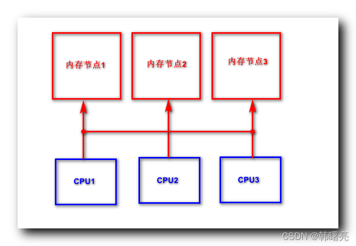
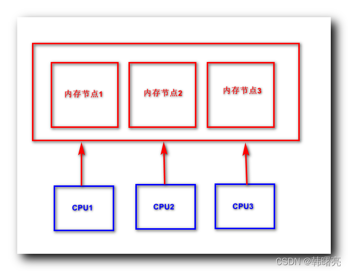

【Linux 内核 内存管理】物理内存组织结构 ① ( 多处理器体系结构 | SMP/UMA 对称多处理器结构 | NUMA 非一致内存访问结构 )

#### 文章目录

-   [一、多处理器体系结构](https://cloud.tencent.com/developer?from_column=20421&from=20421)
-   -   [1、SMP/UMA 对称多处理器结构](https://cloud.tencent.com/developer?from_column=20421&from=20421)
    -   [2、NUMA 非一致内存访问结构](https://cloud.tencent.com/developer?from_column=20421&from=20421)

## 一、多处理器体系结构

* * *

### 1、SMP/UMA 对称多处理器结构

对称多处理器结构 , 英文名称为 " Symmetrical Multi-Processing " , 简称 SMP ;

SMP 又称为 UMA , 全称 " Uniform Memory Access " , 中文名称 " 统一内存访问架构 " ;

在 " 对称多处理器结构 " 的 系统中 , 所有的 CPU 处理器 的 地位 都是 平等的 , 一般指的是 [服务器](https://cloud.tencent.com/act/pro/promotion-cvm?from_column=20065&from=20065) 设备上 , 运行的 多个 CPU , 没有 主次/从属 关系 , 都是平等的 ;

这些处理器 共享 所有的设备资源 , 所有的资源 对 处理器 具有相同的 可访问性 , 如 : 磁盘 , 内存 , 总线 等 ; 多个 CPU 处理器 共享相同的物理内存 , 每个 CPU 访问相同的物理地址 , 所消耗的时间是相同的 ;

参考 [【Linux 内核】SMP 对称多处理器结构 ( SMP 对称多处理器结构概念 | SMP 对称多处理器结构的优势与缺陷 | Linux 内核兼容多处理器要求 )](https://cloud.tencent.com/developer/tools/blog-entry?target=https%3A%2F%2Fblog.csdn.net%2Fshulianghan%2Farticle%2Fdetails%2F123894408&source=article&objectId=2253497) 博客 ;

在 SMP 结构中 , 将 内存 划分成 多个 " 内存节点 " , 每个内存节点对应一个处理器 , 访问 " 内存节点 " 的性能 取决于 处理器 与 内存节点 的距离 ,

**处理器 访问自己的 " 内存节点 " 性能高 , 时间短 , 访问其它 " 内存节点 " 性能低 , 时间长 ;**

在这里插入图片描述

### 2、NUMA 非一致内存访问结构

非一致内存访问结构 , 英文名称 Non Uniform Memory Access , 简称 NUMA ;

" 非一致内存访问结 " 的 系统 , 有 多个 CPU 处理器 , 每个 处理器 都有 自己的 独立的本地内存 , 每个 CPU 处理器只支持 自己的本地内存快速访问 , 各个 CPU 处理器之间通过 " 总线 " 连接 ;

处理器通过 " 总线 " 可以 访问 其它处理器 的 " 内存 " , 但是 处理器 访问 自己的内存 要比 访问 其它处理器的内存 速度要快 ;

NUMA 非一致内存访问结构 , 可以 支持 CPU 扩展 , 可以扩展上百 CPU 处理器 ;

参考 [【Linux 内核】NUMA 非一致内存访问结构 ( NUMA 概念介绍 | NUMA 架构优势分析 | SMP、NUMA、MPP 架构 )](https://cloud.tencent.com/developer/tools/blog-entry?target=https%3A%2F%2Fblog.csdn.net%2Fshulianghan%2Farticle%2Fdetails%2F123905502&source=article&objectId=2253497) 博客 ;

**在 NUMA 架构中 , CPU 处理器 访问 内存 的性能都是相同的 ;**

